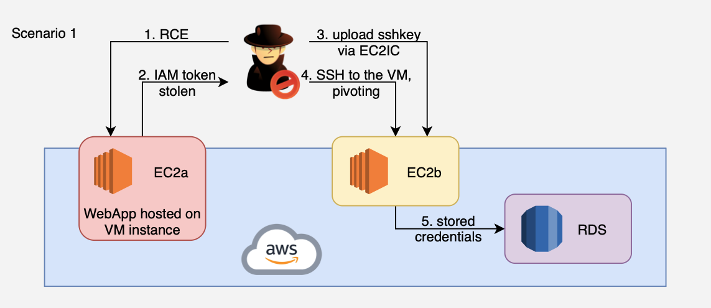

# 1. RCE on EC2 to RDS Pivot

## Overview
This scenario demonstrates a multi-stage AWS compromise starting from a Remote Code Execution (RCE) vulnerability in a public-facing web application on EC2-A. The attacker leverages the instance’s IAM role credentials obtained via the Instance Metadata Service (IMDS) to enumerate the environment and discover a second EC2 instance (EC2-B). Using EC2 Instance Connect, the attacker injects an SSH key to pivot into EC2-B, where database credentials are stored in environment variables. With these credentials, the attacker connects to a private RDS MySQL database and exfiltrates sensitive data.

This exercise highlights how public exposure, over-permissive IAM roles, insecure credential storage, and weak network segmentation can be chained to achieve full data compromise.

&nbsp;

## Required Resources

**Networking**
- 1 VPC, single region
- 1 public subnet (EC2-A and EC2-B), 2 private subnets (RDS subnet group)
- Internet Gateway attached to VPC
- Security Groups
  - Allow HTTP (80) and SSH (22) from attacker IP to EC2-A
  - Allow SSH (22) from attacker IP to EC2-B
  - Allow MySQL (3306) from EC2-B to RDS

**Compute**
- EC2-A — Public web server running a vulnerable Flask application (RCE endpoint)
- EC2-B — Internal instance with MySQL client and database credentials in environment variables

**Database**
- RDS MySQL — Private database storing sensitive data (mysql.user table)

**IAM / Identities & Access**
- EC2-A role — `ec2:DescribeInstances`, `ec2-instance-connect:SendSSHPublicKey`, SSM managed policy
- EC2-B role — SSM managed policy (for Session Manager access)

&nbsp;

## Scenario Goals
The attacker’s objective is to compromise an internet-exposed EC2 instance, abuse its IAM permissions for lateral movement to a second instance, extract database credentials, and exfiltrate sensitive data from an RDS MySQL database.

&nbsp;

## Diagram


&nbsp;

## Attack Walkthrough
- **Initial Access** — Exploit an RCE vulnerability on EC2-A’s web application (`/cmd` endpoint)
- **Credential Harvesting** — Steal temporary AWS credentials from the Instance Metadata Service (IMDSv2)
- **Enumeration** — Probe IAM permissions and discover EC2-B via `ec2:DescribeInstances`
- **Lateral Movement** — Inject an SSH public key to EC2-B via EC2 Instance Connect
- **Credential Theft** — Extract RDS connection details from EC2-B’s environment variables
- **Data Exfiltration** — Connect to RDS MySQL and exfiltrate the `mysql.user` table

&nbsp;

## Expected Results
- Temporary AWS credentials harvested from IMDS
- Lateral movement to EC2-B via SSH key injection
- RDS MySQL credentials extracted from environment variables
- Sensitive data (database user accounts and password hashes) exfiltrated

&nbsp;

## Getting Started

#### Install Dependencies

MacOS
```bash
brew install terraform awscli jq
```
Linux
```bash
sudo apt update && sudo apt install -y terraform awscli jq
```

#### Deploy

Use the provided Terraform configuration to deploy the full lab environment. At the end of the deployment, Terraform will display the public IP of EC2-A — save this value for the attack script.

Add the public IP (or CIDR) of your attack machine to the whitelist so the script can reach the target.

```bash
terraform init
terraform apply -var=’attack_whitelist=["87.68.140.7/32"]’ -auto-approve
```

#### Attack Execution
Execute the attack script from your local terminal and provide the EC2-A public IP when prompted.

```bash
chmod +x attack.sh
./attack.sh
```

#### Clean Up
Destroy all resources to avoid ongoing costs.

```bash
terraform destroy -var=’attack_whitelist=[]’ -auto-approve
```
