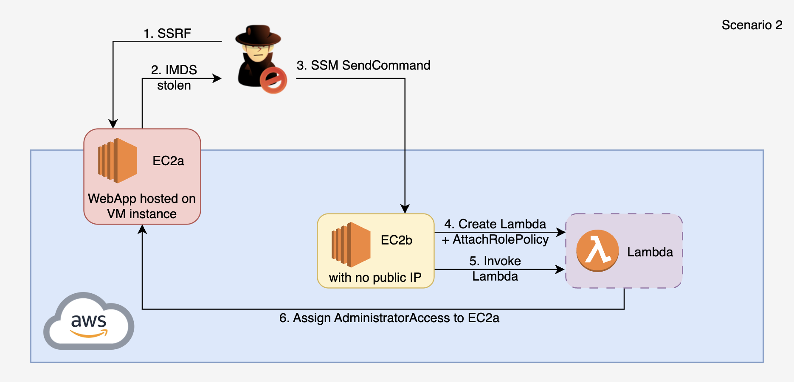

# 2. SSRF on EC2 to Lambda Privilege Escalation

## Overview
This scenario demonstrates a multi-stage AWS compromise starting from a Server-Side Request Forgery (SSRF) vulnerability in a public-facing web application on EC2-A. The attacker leverages SSRF to access the Instance Metadata Service (IMDSv1) and steal temporary IAM role credentials. Using the stolen credentials, the attacker enumerates the environment and discovers EC2-B accessible via AWS Systems Manager (SSM). After pivoting to EC2-B, the attacker discovers its IAM role has permissions to create Lambda functions and pass IAM roles. By enumerating available roles, the attacker finds one with `iam:AttachRolePolicy` and creates a privilege escalation Lambda that attaches AdministratorAccess to EC2-A's role, achieving full account compromise.

This exercise highlights how SSRF exploitation, overly permissive IAM roles, and misconfigured Lambda execution roles can be chained to escalate from a single web vulnerability to full AWS account takeover.

&nbsp;

## Required Resources

**Networking**
- 1 VPC, single region
- 1 public subnet (EC2-A), 1 private subnet (EC2-B)
- Internet Gateway attached to VPC
- NAT Gateway for EC2-B outbound access
- Security Groups
  - Allow HTTP (8080) and SSH (22) from attacker IP to EC2-A
  - Allow SSH (22) from public SG to EC2-B

**Compute**
- EC2-A — Public web server running a vulnerable Flask application (SSRF endpoint)
- EC2-B — Internal instance used as pivot for Lambda-based privilege escalation

**Serverless**
- Lambda — Deployed by attacker during the attack for privilege escalation

**IAM / Identities & Access**
- EC2-A role — `ec2:DescribeInstances`, `ssm:SendCommand`, `ssm:StartSession`, SSM managed policy
- EC2-B role — `lambda:CreateFunction`, `lambda:InvokeFunction`, `iam:PassRole`, `iam:ListRoles`, `iam:GetRole`, `iam:ListRolePolicies`, `iam:GetRolePolicy`
- Lambda execution role — `iam:AttachRolePolicy` (enables privilege escalation)

&nbsp;

## Scenario Goals
The attacker's objective is to exploit an SSRF vulnerability on a public EC2 instance, steal IMDS credentials, pivot to an internal EC2 instance via SSM, and escalate privileges to full AWS account administrator access through a malicious Lambda function.

&nbsp;

## Diagram


&nbsp;

## Attack Walkthrough
- **Initial Access** — Exploit SSRF vulnerability on EC2-A to access the Instance Metadata Service (IMDSv1) and steal IAM role credentials
- **Enumeration** — Probe IAM permissions and discover EC2-B via `ec2:DescribeInstances`
- **Lateral Movement** — Pivot to EC2-B via SSM SendCommand to execute commands remotely
- **Privilege Discovery** — Enumerate EC2-B's role permissions (`lambda:CreateFunction`, `iam:PassRole`) and discover a role with `iam:AttachRolePolicy`
- **Privilege Escalation** — Create a Lambda function with the privileged role that attaches AdministratorAccess to EC2-A's role
- **Full Compromise** — Invoke the Lambda to escalate EC2-A's role to full administrator access

&nbsp;

## Expected Results
- Temporary AWS credentials harvested from IMDS via SSRF
- Lateral movement to EC2-B via SSM
- Discovery of Lambda management permissions and AttachRolePolicy role
- Privilege escalation Lambda created and invoked
- EC2-A role escalated to AdministratorAccess (full account compromise)

&nbsp;

## Getting Started

#### Install Dependencies

MacOS
```bash
brew install terraform awscli jq
```
Linux
```bash
sudo apt update && sudo apt install -y terraform awscli jq
```

#### Deploy

Use the provided Terraform configuration to deploy the full lab environment. At the end of the deployment, Terraform will display the public IP of EC2-A — save this value for the attack script.

Add the public IP (or CIDR) of your attack machine to the whitelist so the script can reach the target.

```bash
terraform init
terraform apply -var='attack_whitelist=["87.68.140.7/32"]' -auto-approve
```

#### Attack Execution
Execute the attack script from your local terminal and provide the EC2-A public IP when prompted.

```bash
chmod +x attack.sh
./attack.sh
```

#### Clean Up
Destroy all resources to avoid ongoing costs.

```bash
terraform destroy -var='attack_whitelist=[]' -auto-approve
```
