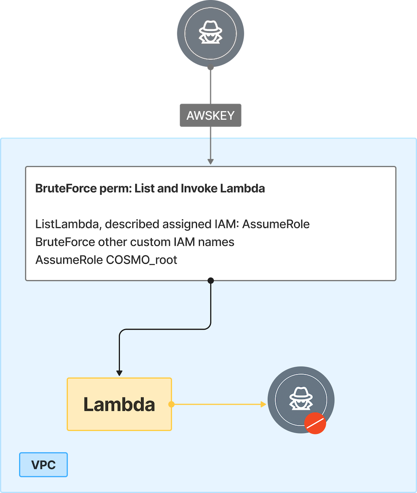

# 3. Privilege Escalation via Lambda and IAM Role Enumeration

## 🗺️ Overview
This scenario demonstrates how a leaked AWS access key can be abused to escalate privileges through weak IAM design. An attacker begins with a compromised long-term access key that initially provides only limited permissions, but is able to enumerate roles, policies, and Lambda functions. By updating the code of a privileged Lambda function and leveraging attached IAM roles, the attacker discovers predictable role naming conventions and successfully enumerates trust relationships. Ultimately, they assume the steamgoat_root role with AdministratorAccess, granting full control of the AWS environment. 

This scenario highlights how exposed credentials, over-permissive role assumption, and weak IAM structures can cascade into complete account compromise.

&nbsp;

## 🧩 Required Resources

**Compute**
- None directly leveraged (attack is credential-driven)

**Serverless**
- Lambda Function - Attacker controlled arbitrary code

**Identities & Access**
- User with leaked AWS key – lambda:ListFunctions, lambda:InvokeFunction, lambda:UpdateFunctionCode, iam:GetRole
- SteamGoat_Lambda role - Has sts:AssumeRole
- SteamGoat_Users role - Discovered via Lambda attachment
- Brute-forced roles
- SteamGoat_root role - AdministratorAccess

&nbsp;

## 🎯 Scenario Goals
Demonstrate how leaked access keys and poorly designed IAM role structures can allow an attacker to escalate from limited Lambda interaction to full AWS account compromise.

&nbsp;

## 🖼️ Diagram


&nbsp;

## 🗡️ Attack Walkthrough
- **Initial Access** - Attacker obtains a leaked AWS access key (AWSKEY).
- **Enumeration** - Brute-forces service permissions (EC2, S3, EKS, Lambda); only lambda:ListFunctions succeeds.
- **Discovery** - Uses lambda:GetFunction to review configuration and identify the attached IAM role COSMO_Users.
- **Role Probing** - Notes that COSMO_Users has sts:AssumeRole and begins brute-forcing additional custom role names (COSMO_devops, COSMO_dev, COSMO_backup, etc.).
- **Privilege Escalation** - Successfully assumes the COSMO_root role, which has AdministratorAccess.
- **Full Compromise** - Executes administrative actions with COSMO_root, achieving full account takeover.

&nbsp;

## 📈 Expected Results
**Successful Completion** - The attacker enumerates IAM roles, assumes COSMO_root, and obtains AdministratorAccess, resulting in full account compromise.

&nbsp;

## 🚀 Getting Started

#### Install Dependencies
macOS
```bash
brew install terraform awscli jq
```
Linux
```bash
sudo apt update && sudo apt install -y terraform awscli jq
```

#### 🏗️ Deploy
Before deploying, download the provided Terraform configuration and attack script to the machine where you will run the attack steps.

Use the provided Terraform configuration to deploy the full lab environment.


```bash
terraform init
terraform apply -auto-approve
```

#### 📝 Get Output Values
Execute the commands below to collect the values that will serve as the attack script’s starting inputs
```bash
terraform output --json | jq -r '"ACCESS KEY ID: \(.streamgoat_user_access_key_id.value) \nACCESS SECRET KEY: \(.streamgoat_user_secret_access_key.value)"'
```

#### 🎯 Attack Execution
Execute the attack script from your local terminal and use the output values provided at the end of the deployment as input parameters.

```bash
chmod +x attack.sh
./attack.sh
```

#### 🧹 Clean Up
When you are finished, destroy all resources to avoid ongoing costs. This will tear down the entire lab environment including all compute, networking, and IAM components created during deployment.

Use the following command for a full cleanup

```bash
terraform destroy -auto-approve
```
