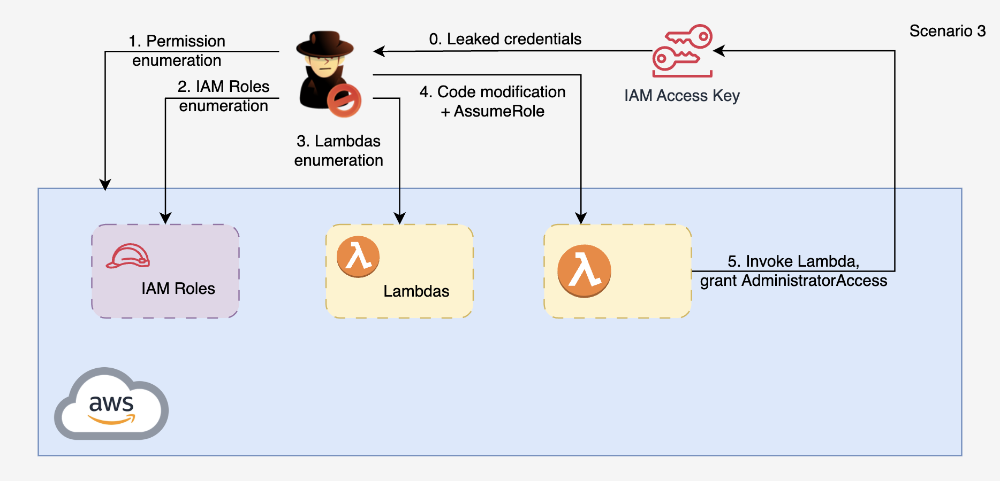

# 3. Privilege Escalation via Lambda Code Injection and IAM Role Enumeration

## Overview
This scenario demonstrates how a leaked AWS access key can be abused to escalate privileges through weak IAM design and Lambda code injection. The attacker begins with a compromised long-term access key that provides IAM read-only permissions and full Lambda access (except CreateFunction). By enumerating roles, policies, and Lambda functions, the attacker discovers a Lambda function whose execution role has `sts:AssumeRole` permission on any StreamGoat role. Among the enumerated roles, one has AdministratorAccess attached. The attacker updates the Lambda code via `UpdateFunctionCode` to assume the admin role and attach AdministratorAccess to their own user, achieving full account compromise.

This exercise highlights how exposed credentials, over-permissive role assumption, and missing restrictions on Lambda code updates can cascade into complete account takeover.

&nbsp;

## Required Resources

**Serverless**
- StreamGoat-Lambda_1 — Benign Lambda function (distraction)
- StreamGoat-Lambda_2 — Lambda with execution role that has `sts:AssumeRole` on StreamGoat-* roles

**IAM / Identities & Access**
- StreamGoat-user — IAM user with leaked access keys, has `iam:List*`, `iam:Get*`, `lambda:*` (except CreateFunction)
- StreamGoat-Role-admin — IAM role with AdministratorAccess (target for assumption)
- StreamGoat-Role-user/dev/engineer/marketing — Additional roles with varying policies
- StreamGoat-Lambda2-ExecRole — Lambda execution role with `sts:AssumeRole` permission

&nbsp;

## Scenario Goals
The attacker's objective is to leverage leaked IAM credentials to enumerate roles and Lambda functions, identify a privilege escalation path through Lambda code injection, and escalate to full AWS account administrator access.

&nbsp;

## Diagram


&nbsp;

## Attack Walkthrough
- **Initial Access** — Configure leaked AWS access keys and validate via STS
- **Enumeration** — Probe service permissions, discover `iam:List*` and `lambda:*` access
- **Role Discovery** — Enumerate StreamGoat-Role-* roles, find StreamGoat-Role-admin with AdministratorAccess
- **Lambda Discovery** — Inspect Lambda functions, find Lambda_2's execution role has `sts:AssumeRole`
- **Privilege Escalation** — Update Lambda_2 code to assume admin role and attach AdministratorAccess to the user
- **Full Compromise** — Invoke modified Lambda, verify admin access via re-enumeration

&nbsp;

## Expected Results
- Leaked credentials validated and permissions enumerated
- StreamGoat-Role-admin discovered with AdministratorAccess
- Lambda_2 identified with sts:AssumeRole capability
- Lambda code injected to assume admin role and escalate privileges
- StreamGoat-user escalated to AdministratorAccess (full account compromise)

&nbsp;

## Getting Started

#### Install Dependencies

MacOS
```bash
brew install terraform awscli jq zip
```
Linux
```bash
sudo apt update && sudo apt install -y terraform awscli jq zip
```

#### Deploy

Use the provided Terraform configuration to deploy the full lab environment.

```bash
terraform init
terraform apply -auto-approve
```

#### Get Output Values
Execute the command below to retrieve the leaked credentials for the attack script.

```bash
terraform output --json | jq -r '"ACCESS KEY ID: \(.streamgoat_user_access_key_id.value) \nACCESS SECRET KEY: \(.streamgoat_user_secret_access_key.value)"'
```

#### Attack Execution
Execute the attack script from your local terminal and provide the leaked credentials when prompted.

```bash
chmod +x attack.sh
./attack.sh
```

#### Clean Up
Destroy all resources to avoid ongoing costs.

```bash
terraform destroy -auto-approve
```
