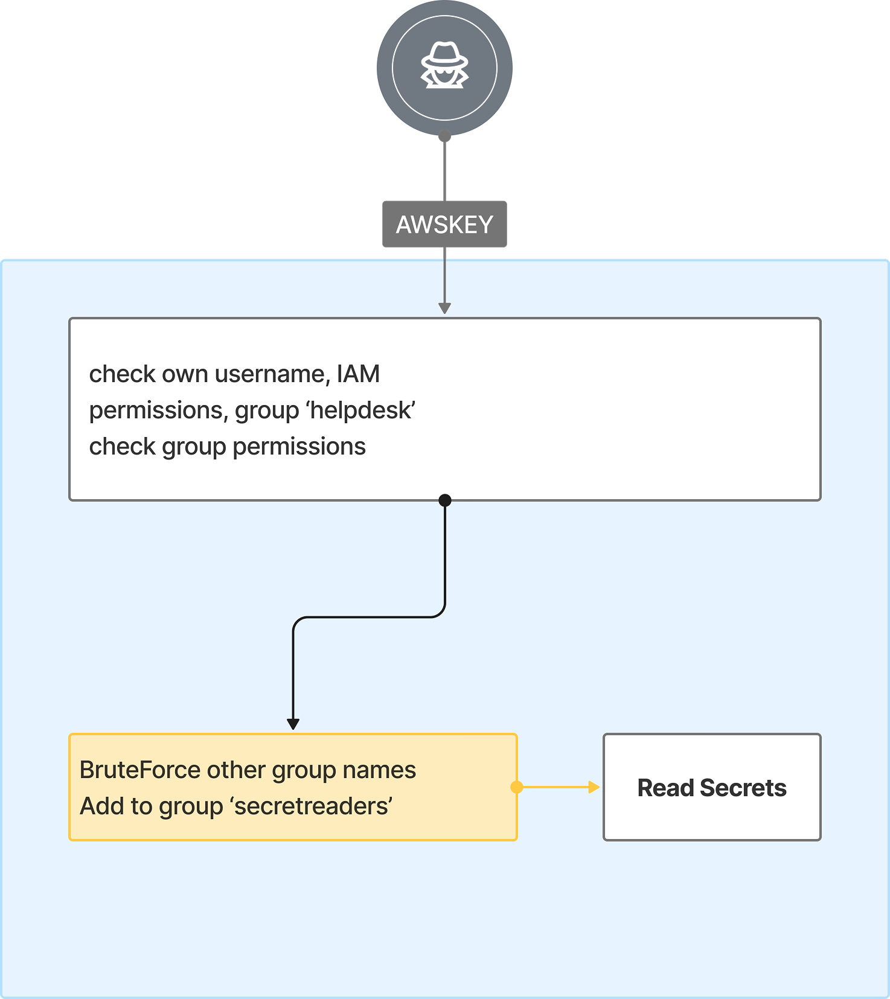

# 4. From Helpdesk user to Secret Readers

## 🗺️ Overview
This scenario demonstrates how an attacker can abuse overly permissive IAM group management when starting with a leaked AWS access key. After authenticating with the compromised key, the attacker discovers they have permission to call iam:AddUserToGroup but cannot list existing groups. To overcome this, they attempt to brute-force likely group names and eventually succeed in adding their user account to a high-privilege group, StreamGoat_SecretReader, that grants access to AWS Secrets Manager. With these new privileges, the attacker enumerates and exfiltrates sensitive secrets. This exercise highlights how leaked long-term credentials, weak IAM design, and the lack of proper controls on group membership can lead to privilege escalation and the compromise of sensitive data.

&nbsp;

## 🧩 Required Resources

**Identities & Access**
- User 'peter.parker' with leaked AWS key, member of a group 'StreamGoat-Group-helpdesk'
- Group 'StreamGoat-Group-helpdesk' with multiple iam:List/Get permissions for Roles and Policies + iam:AddUserToGroup
- Group 'StreamGoat-Group-secretreaders' with permissions to list and get secrets' value
- Secret 'StreamGoat-DB-PROD-xxxx' with sensitive login/password

&nbsp;

## 🎯 Scenario Goals
- Demonstrate how a leaked AWS access key combined with permissive S3 policies can lead to both data theft and code execution.  
- Show how attackers can abuse Lambda roles to escalate privileges and assume administrative access.

&nbsp;

## 🖼️ Diagram


&nbsp;

## 🗡️ Attack Walkthrough
- **Initial Access** - Attacker authenticates using the leaked AWS access key.
- **Recon / Constraint Discovery** - Finds permissions to call iam:AddUserToGroup but not to list groups.
- **Brute Force Group Names** - Attempts to add self to likely group names.
- **Privilege Escalation** - Successfully joins StreamGoat_SecretReader.
- **Secret Exfiltration** - Uses new privileges to list and read secrets in AWS Secrets Manager.

&nbsp;

## 📈 Expected Results
**Successful Completion** - Admin role assumed via Lambda exploitation.

&nbsp;

## 🚀 Getting Started

#### Install Dependencies
macOS
```bash
brew install terraform awscli jq
```
Linux
```bash
sudo apt update && sudo apt install -y terraform awscli jq
```

#### 🏗️ Deploy
Before deploying, download the provided Terraform configuration and attack script to the machine where you will run the attack steps.

Use the provided Terraform configuration to deploy the full lab environment.

```bash
terraform init
terraform apply -auto-approve
```

#### 📝 Get Output Values
Execute the commands below to collect the values that will serve as the attack script’s starting inputs
```bash
terraform output --json | jq -r '"ACCESS KEY ID: \(.leaked_user_access_key_id.value) \nACCESS SECRET KEY: \(.leaked_user_secret_access_key.value)"'
```

#### 🎯 Attack Execution
Execute the attack script from your local terminal and use the output values provided at the end of the deployment as input parameters.

```bash
chmod +x attach.sh
./attack.sh
```

#### 🧹 Clean Up
When you are finished, destroy all resources to avoid ongoing costs. This will tear down the entire lab environment including all compute, networking, and IAM components created during deployment.

Use the following command for a full cleanup

```bash
terraform destroy -auto-approve
```
