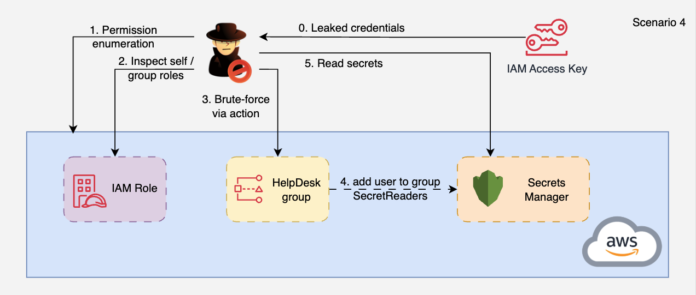

# 4. From Helpdesk User to Secret Exfiltration

## Overview
This scenario demonstrates how an attacker can abuse overly permissive IAM group management starting from a leaked AWS access key. After authenticating with the compromised helpdesk user credentials, the attacker discovers they have `iam:AddUserToGroup` permission scoped to `StreamGoat-Group-*` but cannot list existing groups. To overcome this, they brute-force likely group names by attempting `AddUserToGroup` calls — a failed call means the group doesn't exist, while a successful call means the group exists and the user is now a member. The attacker successfully joins the `StreamGoat-Group-secretreaders` group, which grants access to AWS Secrets Manager, and exfiltrates sensitive database credentials.

This exercise highlights how leaked long-term credentials, weak IAM design, and the lack of proper controls on group membership can lead to privilege escalation and the compromise of sensitive data.

&nbsp;

## Required Resources

**IAM / Identities & Access**
- User `peter.parker` with leaked AWS access key, member of `StreamGoat-Group-helpdesk`
- Group `StreamGoat-Group-helpdesk` — `iam:ListGroupsForUser`, `iam:AddUserToGroup` (to StreamGoat-Group-*), read policies on StreamGoat groups
- Group `StreamGoat-Group-secretreaders` — `secretsmanager:ListSecrets`, `secretsmanager:GetSecretValue` (on StreamGoat-*)

**Secrets**
- Secrets Manager secret `StreamGoat-DB-PROD-*` containing database credentials

&nbsp;

## Scenario Goals
The attacker's objective is to leverage a leaked helpdesk user key, discover exploitable IAM permissions, brute-force group names to escalate privileges via group membership, and exfiltrate sensitive secrets from AWS Secrets Manager.

&nbsp;

## Diagram


&nbsp;

## Attack Walkthrough
- **Initial Access** — Configure leaked AWS access key for the helpdesk user
- **Enumeration** — Probe service permissions (mostly denied), discover limited IAM access
- **IAM Introspection** — Enumerate group memberships and policies, discover `iam:AddUserToGroup` permission
- **Group Brute-force** — Attempt `AddUserToGroup` with guessed group names, successfully join `StreamGoat-Group-secretreaders`
- **Secret Exfiltration** — Use newly inherited permissions to list and dump secrets from Secrets Manager

&nbsp;

## Expected Results
- Leaked helpdesk credentials validated
- IAM introspection reveals `iam:AddUserToGroup` permission on StreamGoat-Group-* prefix
- Group name brute-force succeeds — user joins `StreamGoat-Group-secretreaders`
- Secrets Manager credentials exfiltrated (database admin username/password)

&nbsp;

## Getting Started

#### Install Dependencies

MacOS
```bash
brew install terraform awscli jq
```
Linux
```bash
sudo apt update && sudo apt install -y terraform awscli jq
```

#### Deploy

Use the provided Terraform configuration to deploy the full lab environment.

```bash
terraform init
terraform apply -auto-approve
```

#### Get Output Values
Execute the command below to retrieve the leaked credentials for the attack script.

```bash
terraform output --json | jq -r '"ACCESS KEY ID: \(.leaked_user_access_key_id.value) \nACCESS SECRET KEY: \(.leaked_user_secret_access_key.value)"'
```

#### Attack Execution
Execute the attack script from your local terminal and provide the leaked credentials when prompted.

```bash
chmod +x attack.sh
./attack.sh
```

#### Clean Up
Destroy all resources to avoid ongoing costs.

```bash
terraform destroy -auto-approve
```
