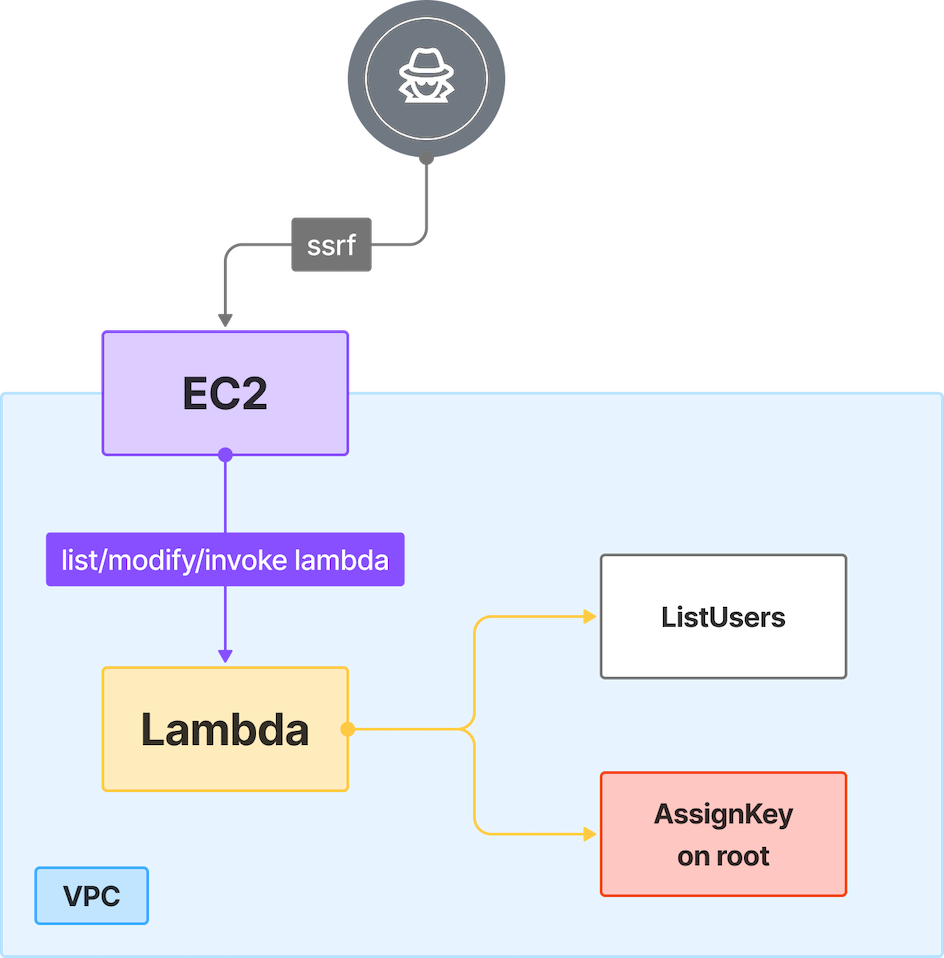

# 5. Privilege Escalation via CreateAccessKey

## 🗺️ Overview
This scenario demonstrates how a leaked long-term AWS access key for a low-privileged user that includes broad Lambda permissions can be abused to escalate privileges. An attacker with the leaked keys enumerates Lambda functions, downloads and inspects function code, and—because the compromised user can update Lambda code—replaces the function with payloads that exercise IAM actions (create/delete user, group, role, policy) and attempt to create access keys for guessed usernames. Any successfully-created access keys can be validated and used to discover higher-privilege accounts (for example, an Administrator-attached user), providing persistent project-wide access.

&nbsp;

## 🧩 Required Resources

**Serverless**
- Lambda function - Capable of managing IAM users and keys

**IAM / Identities & Access**
- Lambda execution role - Permissions to manage IAM users and keys
- Root user - Existing account with full administrative privileges

&nbsp;

## 🎯 Scenario Goals
Demonstrate how a leaked long-term access key with broad Lambda permissions can be misused to:
- enumerate and download Lambda code
- replace Lambda code to run reconnaissance using the Lambda's execution role
- test and exercise IAM creation permissions (users/groups/policies/roles)
- create AccessKeys for guessed users and validate whether any of them have Administrator-level privileges

This shows how improper IAM scoping and over-permissive Lambda access can lead to privilege escalation and persistent compromise.

&nbsp;

## 🖼️ Diagram


&nbsp;

## 🗡️ Attack Walkthrough
- **Initial Access** - Attacker receives the Terraform-outputted access key
- **Enumerate Permissions** - Use the leaked keys to call `aws sts get-caller-identity` and enumerate available services; confirm broad Lambda permissions.
- **Inspect User Policies** - Query inline and attached policies to understand what the compromised user can do.
- **Enumerate Lambda Functions** - List Lambda functions and download the deployment package to review existing logic (the bundled function creates users/groups when invoked).
- **Replace Lambda Code for Enumeration** - Update the Lambda to run a suite of API checks using the Lambda's execution role (step 5). This allows you to discover what the Lambda role can access.
- **Create/Delete Tests** - Replace the Lambda with code that performs create/delete operations for user, group, policy, and role to confirm Create/Delete behavior.
- **CreateAccessKey Guessing** - Replace the Lambda with payload that attempts key creation for a list of guessed usernames (StreamGoat-User-<name> candidates). If successful, the Lambda returns newly-created credentials.
- **Validate Captured Keys** - Use any captured keys to authenticate, enumerate attached policies, and detect administrative privileges (e.g., `AdministratorAccess`).
- **Persistence & Takeover** - If Administrator-level credentials are found, the attacker obtains persistent, full account control.


&nbsp;

## 📈 Expected Results
**Successful Completion** - The attacker captures newly-created credentials for a user with Administrator-level privileges (or equivalent), granting persistent, full account-wide control.

&nbsp;

## 🚀 Getting Started

#### Install Dependencies
macOS
```bash
brew install terraform awscli jq
```
Linux
```bash
sudo apt update && sudo apt install -y terraform awscli jq
```

#### 🏗️ Deploy
Before deploying, download the provided Terraform configuration and attack script to the machine where you will run the attack steps.

Use the provided Terraform configuration to deploy the full lab environment.

```bash
terraform init
terraform apply -auto-approve
```

#### 📝 Get Output Values
Execute the commands below to collect the values that will serve as the attack script’s starting inputs
```bash
terraform output --json | jq -r '"ACCESS KEY ID: \(.neo_access_key_id.value) \nACCESS SECRET KEY: \(.neo_secret_access_key.value)"'
```

#### 🎯 Attack Execution
Execute the attack script from your local terminal and use the output values provided at the end of the deployment as input parameters.

```bash
chmod +x attack.sh
./attack.sh
```

#### 🧹 Clean Up
When you are finished, destroy all resources to avoid ongoing costs. This will tear down the entire lab environment including all compute, networking, and IAM components created during deployment.

Use the following command for a full cleanup

```bash
terraform destroy -auto-approve
```
