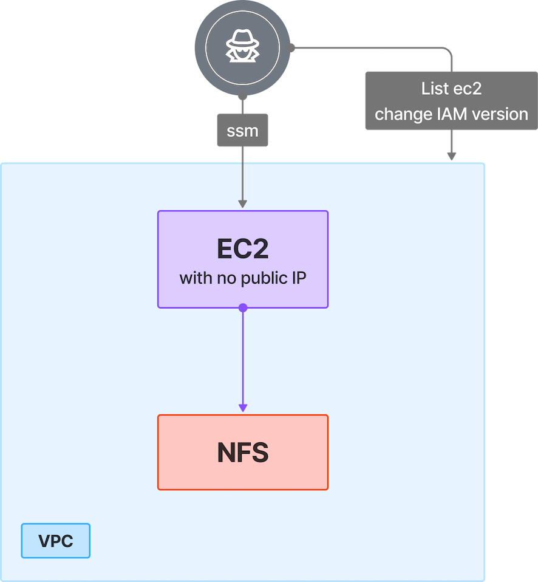

# 6. IAM Policy Abuse and Lateral Movement via SSM to NFS

## 🗺️ Overview
This scenario demonstrates how leaked AWS access keys combined with IAM policy version manipulation can be abused to reach private resources. The attacker begins with compromised credentials and switches between multiple IAM policy versions: first enabling ec2:DescribeInstances to map the environment, then activating ssm:StartSession to establish a session into a private EC2 instance with no public IP. Once inside the subnet, they enumerate additional assets and discover an exposed NFS server, which they then access to extract sensitive data. This scenario highlights the risks of leaked credentials, misconfigured IAM policies, over-permissive SSM access and weak network segmentation that allow attackers to pivot into private infrastructure and compromise internal systems.

&nbsp;

## 🧩 Required Resources

**Networking**
- 1 VPC with private subnet  
- Security Groups - allowing internal EC2-to-NFS communication  

**Compute**
- EC2 instance - Private subnet, no public IP (SSM-enabled)  

**Storage / Database**
- NFS server - Exposed within subnet  

**IAM / Identities & Access**
- IAM role with multiple policy versions:  
  - Version A - ec2:DescribeInstances  
  - Version B - ssm:StartSession  

&nbsp;

## 🎯 Scenario Goals
- Demonstrate the impact of IAM policy version manipulation combined with leaked AWS credentials.  
- Show how an attacker can use SSM as a backdoor into private EC2 instances.  
- Highlight risks of lateral movement inside a subnet leading to NFS data access.  

&nbsp;

## 🖼️ Diagram


&nbsp;

## 🗡️ Attack Walkthrough
- **Initial Access** - Attacker obtains leaked AWS keys.  
- **Policy Abuse** - Switches between IAM policy versions to enable ec2:DescribeInstances and ssm:StartSession.  
- **Pivoting** - Uses SSM to access a private EC2 instance without a public IP.  
- **Lateral Movement** - From inside the subnet, scans for additional resources.  
- **Data Access** - Connects to exposed NFS server and extracts sensitive data.  

&nbsp;

## 📈 Expected Results
**Successful Completion** - NFS server accessed from private subnet.  

&nbsp;

## 🚀 Getting Started

#### Install Dependencies
macOS
```bash
brew install terraform awscli jq
```
Linux
```bash
sudo apt update && sudo apt install -y terraform awscli jq
```

#### 🏗️ Deploy
Before deploying, download the provided Terraform configuration and attack script to the machine where you will run the attack steps.

Use the provided Terraform configuration to deploy the full lab environment.

```bash
terraform init
terraform apply -auto-approve
```

#### 📝 Get Output Values
Execute the commands below to collect the values that will serve as the attack script’s starting inputs
```bash
terraform output --json | jq -r '"ACCESS KEY ID: \(.leaked_access_key.value) \nACCESS SECRET KEY: \(.leaked_secret_key.value)"'
```

#### 🎯 Attack Execution
Execute the attack script from your local terminal and use the output values provided at the end of the deployment as input parameters.

```bash
chmod +x attack.sh
./attack.sh
```

#### 🧹 Clean Up
When you are finished, destroy all resources to avoid ongoing costs. This will tear down the entire lab environment including all compute, networking, and IAM components created during deployment.

Use the following command for a full cleanup:

```bash
terraform destroy -auto-approve
```
