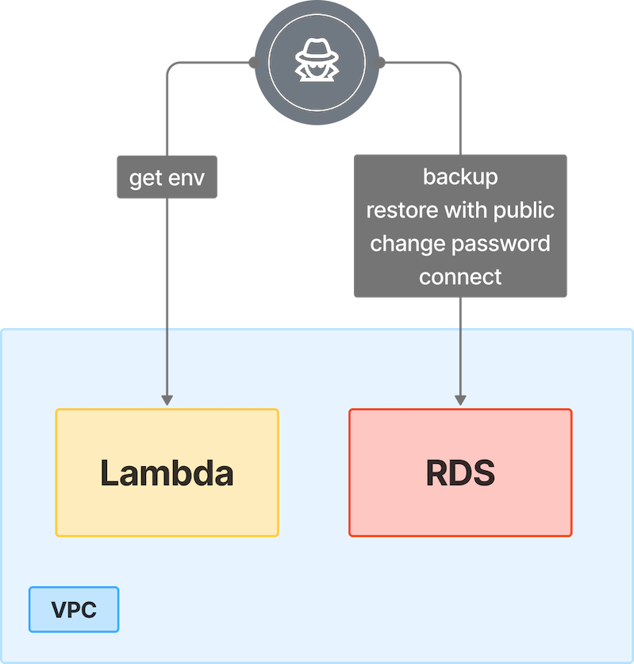

# 7. Leaked AWS Key to RDS via Lambda Abuse

## 🗺️ Overview
This scenario demonstrates how a leaked AWS access key with limited Lambda permissions can be escalated into a full database compromise.
Starting with credentials that allow only Lambda `list` and `describe` actions, the attacker enumerates functions and inspects environment variables to discover a second AWS key embedded in a function. That second credential carries RDS manipulation privileges, enabling the attacker to enumerate databases, create a backup and restore it as a publicly accessible instance, change the database password, and connect directly to the exposed RDS, gaining persistent access to sensitive information.
This exercise highlights the dangers of poor secret management, overly permissive IAM roles, and insecure RDS configurations that allow chaining of weak access into full database compromise.

&nbsp;

## 🧩 Required Resources

**Networking**
- 1 × VPC — private and public subnets  
- Security Group — allows RDS connectivity

**Compute**
- Lambda function — stores AWS keys in environment variables

**Serverless**
- Lambda — permissions to list/describe RDS

**Storage / Database**
- RDS instance — stores sensitive data, manipulated by attacker

**IAM / Identities & Access**
- Leaked AWS key — Lambda list/describe permissions  
- IAM role for Lambda — contains AWS key in environment variables  
- Secondary IAM role — RDS manipulation permissions

&nbsp;

## 🎯 Scenario Goals
Simulate abuse of leaked AWS credentials, escalation from Lambda to RDS, and the impact of unauthorized database access and manipulation.

&nbsp;

## 🖼️ Diagram


&nbsp;

## 🗡️ Attack Walkthrough
1. **Initial access** — Attacker obtains AWS key with Lambda permissions.  
2. **Enumeration** — Use the key to list and describe Lambda functions.  
3. **Credential discovery** — Extract environment variables to reveal a second AWS key.  
4. **Privilege escalation** — Second key grants RDS manipulation permissions.  
5. **Database reconnaissance** — List available RDS databases.  
6. **Exposure** — Create backup, restore as public instance, and change password.  
7. **Access** — Connect to the exposed RDS database.

&nbsp;

## 📈 Expected Results

**Successful completion** - RDS instance exposed and accessed with modified credentials.

&nbsp;

## 🚀 Getting Started

#### Install Dependencies
macOS
```bash
brew install terraform awscli jq
```
Linux
```bash
sudo apt update && sudo apt install -y terraform awscli jq
```

#### 🏗️ Deploy
Before deploying, download the provided Terraform configuration and attack script to the machine where you will run the attack steps.

Use the provided Terraform configuration to deploy the full lab environment.

```bash
terraform init
terraform apply -auto-approve
```

#### 🎯 Attack Execution
Execute the attack script from your local terminal and use the output values provided at the end of the deployment as input parameters.

```bash
chmod +x attack.sh
./attack.sh
```

#### 🧹 Clean Up
When you are finished, destroy all resources to avoid ongoing costs. This will tear down the entire lab environment including all compute, networking, and IAM components created during deployment.

Use the following command for a full cleanup:

```bash
terraform destroy -auto-approve
```
