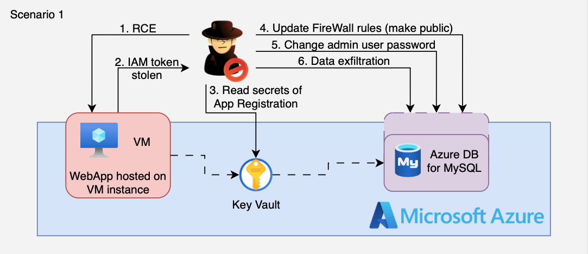

# 1. RCE on VM to MySQL Pivot

## 🗺️ Overview
This scenario demonstrates a multi-stage Azure compromise in which an attacker exploits a remote code execution vulnerability in a public web application hosted on Virtual Machine. Leveraging the instance’s Managed Identity (IMDS) token obtained via the metadata service, the attacker performs enumeration and reads secrets from Azure Key Vault (via RBAC). Using credentials harvested from Key Vault (e.g., a Service Principal client id/secret), the attacker authenticates with client_credentials, enumerates ARM resources and role assignments, then abuses management-plane operations to expose and take over an Azure Database for MySQL (Flexible Server) — making it reachable from the internet and resetting the admin password to exfiltrate data. This exercise highlights how exposed services, over-permissive identities and misconfigured secrets can be chained to achieve data exfiltration in Azure.

&nbsp;

## 🧩 Required Resources

**Networking**
- 1 VNet, single region
- Subnets - 1 private
- Network Security Group allowing HTTP from attacker host IP to VM

**Compute**
- Virtual Machine - Public web server (vulnerable web application, internet-facing)

**Database / Storage**
- Azure Database for MySQL (Flexible Server) - Internal database storing sensitive data
- Azure Key Vault containing service principal credentials used for pivoting

**IAM / Identities & Access**
- Managed Identity attached to Virtual Machine allowing access to IMDS and Azure APIs
- A Service Principal whose client-id / client-secret may be stored in Key Vault (used for pivoting)

&nbsp;

## 🎯 Scenario Goals
The attacker’s objective is to compromise an internet-exposed VM instance, harvest tokens and secrets (Key Vault), authenticate with stolen Service Principal credentials, abuse ARM management APIs to expose and take over a MySQL Flexible Server, and exfiltrate sensitive data.

&nbsp;

## 🖼️ Diagram


&nbsp;

## 🗡️ Attack Walkthrough
- **Initial Access** – Exploit a vulnerable web application on VM to achieve remote code execution (RCE).
- **Token Harvesting** – Obtain a Managed Identity token from Azure Instance Metadata Service to call Graph/ARM.
- **Enumeration** – Use the token to enumerate Azure resources and discover Key Vaults, role assignments and resource identifiers.
- **Vault Access** – Request a token for `vault.azure.net` and enumerate / read secrets from Key Vault (metadata and values where permitted).
- **Credential Harvesting** – Extract Service Principal credentials (client-id / client-secret) from Key Vault secrets if present.
- **Pivot (Control Plane)** – Authenticate using the stolen Service Principal (client_credentials), enumerate resources and role assignments, and identify a MySQL Flexible Server.
- **MySQL Takeover** – Use Contributor/Owner privileges to add permissive firewall rules, reset the admin password (control-plane abuse), and make the MySQL server reachable from the internet.
- **Data Retrieval** – Connect to the MySQL Flexible Server using the new admin credentials and exfiltrate sensitive data.

&nbsp;

## 📈 Expected Results
**Successful Completion** - Sensitive data retrieved from Azure MySQL.

&nbsp;

## 🚀 Getting Started

#### Install Dependencies

MacOS
```bash
brew install terraform jq curl mysql-client
```
Linux (Debian/Ubuntu)
```bash
sudo apt update && sudo apt install -y terraform jq curl mysql-client
```
To install the Azure CLI follow official docs: https://learn.microsoft.com/cli/azure/install-azure-cli

#### Deploy

Before deploying, download the provided Terraform configuration and the `attack.sh` script to the machine where you will run the attack steps.

Use the provided Terraform configuration to deploy the full lab environment. At the end of the deployment Terraform will display output values (e.g., public IP address of the target VM). Save these details; you will need them to run the attack script.

⚠️ If a scenario’s initial step targets a public IP, add the public IP (or CIDR) of the machine that will run the attack script to the environment whitelist via `-var='attack_whitelist=["<your_ip>/32"]'` so the script can reach the target and complete any required interactions. Example:

```bash
terraform init
terraform apply -var='attack_whitelist=["87.68.140.7/32"]' -auto-approve
```

#### Attack Execution
Execute the attack script from your local terminal and use the output values provided at the end of the deployment as input parameters.

```bash
chmod +x attack.sh
./attack.sh
```

#### 🧹 Clean Up
When you are finished, destroy all resources to avoid ongoing costs. This will tear down the entire lab environment including all compute, networking, and IAM components created during deployment.

```bash
terraform destroy -var='attack_whitelist=[]' -auto-approve
```