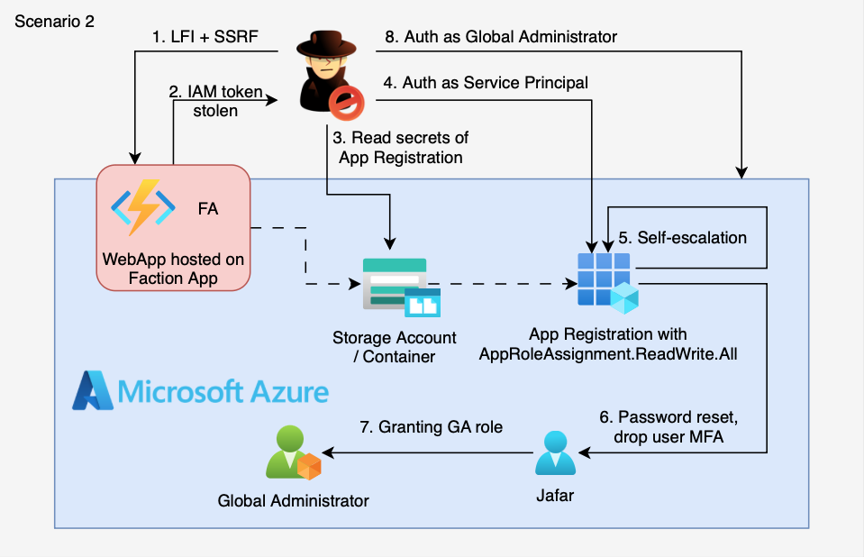

# 2. LFI on Function App → AppRoleAssignment Privilege Escalation to Global Admin

## 🗺️ Overview
This scenario demonstrates a multi-stage Azure compromise that begins with exploiting Local File Inclusion (LFI) and Server-Side Request Forgery (SSRF) vulnerabilities in a public Azure Function App. The attacker reads environment variables to extract Managed Identity credentials, then uses SSRF to obtain access tokens. With these tokens, the attacker enumerates Azure resources and discovers a Storage Account containing backup files with leaked application credentials. These credentials belong to an App Registration with the dangerous `AppRoleAssignment.ReadWrite.All` permission, which allows the attacker to grant themselves `RoleManagement.ReadWrite.Directory` and ultimately escalate to **Global Administrator**.

&nbsp;

## 🧩 Required Resources

**Networking / Compute**
- Azure Function App (Linux, Python) with HTTP trigger endpoint
- Storage Account for function code and backup files

**Identity & Access**
- Function App System-Assigned Managed Identity with:
  - Reader on Resource Group (enumeration)
  - Storage Blob Data Reader (read backup blobs)
- App Registration with `AppRoleAssignment.ReadWrite.All` (privilege escalation vector)
- Test user (Simba) as escalation target

**Storage**
- Blob container with `app_backup_info.txt` containing leaked client_id/secret

&nbsp;

## 🎯 Scenario Goals
The attacker's objective is to exploit a vulnerable Function App, harvest Managed Identity tokens, enumerate storage accounts, steal App Registration credentials from a backup file, and abuse `AppRoleAssignment.ReadWrite.All` to escalate privileges to Global Administrator.

&nbsp;

## 🖼️ Diagram


&nbsp;

## 🗡️ Attack Walkthrough

### Phase 1: Initial Access
- **Exploit LFI** — Discover and exploit the vulnerable `/api/FileReader` endpoint
- **Environment Enumeration** — Read `/proc/self/environ` to extract `IDENTITY_ENDPOINT` and `IDENTITY_HEADER`

### Phase 2: Credential Harvesting  
- **Get Managed Identity Token** — Use SSRF to call the internal Managed Identity endpoint with the extracted header
- **Enumerate Storage Accounts** — Use ARM API to list storage accounts in the resource group
- **Download Backup Blob** — Retrieve `app_backup_info.txt` containing App Registration credentials

### Phase 3: Privilege Escalation
- **Authenticate as App Registration** — Use stolen client_id/secret to get Graph API token
- **Grant RoleManagement.ReadWrite.Directory** — Abuse `AppRoleAssignment.ReadWrite.All` to assign this permission to self
- **Escalate to Global Administrator** — Use `RoleManagement.ReadWrite.Directory` to add user to GA role

&nbsp;

## 📈 Expected Results
**Successful Completion** — Starting from a vulnerable Function App, the attacker escalates privileges through credential theft and Graph API abuse to achieve Global Administrator access in the Azure AD tenant.

&nbsp;

## ⚠️ Privilege Escalation Path Explained

```
┌─────────────────────────────────────────────────────────────────────────┐
│  AppRoleAssignment.ReadWrite.All                                        │
│  ↓                                                                      │
│  Can assign ANY application permission to ANY service principal         │
│  ↓                                                                      │
│  Grant self: RoleManagement.ReadWrite.Directory                         │
│  ↓                                                                      │
│  Can manage directory roles (add/remove members)                        │
│  ↓                                                                      │
│  Add user "Simba" to Global Administrator role                          │
│  ↓                                                                      │
│  FULL TENANT COMPROMISE                                                 │
└─────────────────────────────────────────────────────────────────────────┘
```

&nbsp;

## 🚀 Getting Started

#### Install Dependencies

macOS
```bash
brew install terraform azure-cli jq curl
```

Linux (Debian/Ubuntu)
```bash
sudo apt update && sudo apt install -y terraform jq curl
# Install Azure CLI: https://learn.microsoft.com/cli/azure/install-azure-cli
```

#### Deploy

Before deploying, ensure you are logged in as a **Global Administrator** (required to grant admin consent for `AppRoleAssignment.ReadWrite.All`).

```bash
az login
terraform init
terraform apply -var='attack_whitelist=["YOUR_IP/32"]' -auto-approve
```

Save the output values — you will need `function_app_url` for the attack script.

#### Attack Execution

```bash
chmod +x attack.sh
./attack.sh
```

#### 🧹 Clean Up

When finished, destroy all resources:

```bash
terraform destroy -var='attack_whitelist=[]' -auto-approve
```

**Important:** If you successfully escalated Simba to Global Administrator during the attack, manually remove them from that role before destroying:

```bash
# Remove Simba from Global Administrator (if escalation was successful)
az rest --method DELETE \
  --uri "https://graph.microsoft.com/v1.0/directoryRoles/roleTemplateId=62e90394-69f5-4237-9190-012177145e10/members/$(terraform output -raw disney_user_object_id)/$ref"
```
