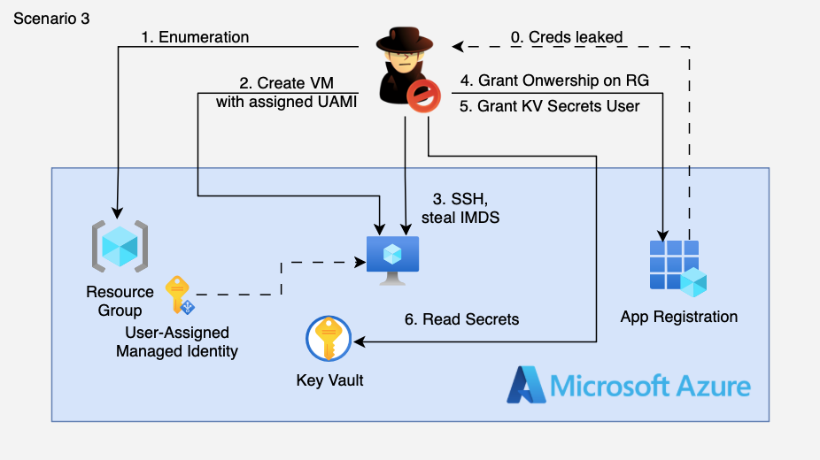

# 3. Leaked App Registration → UAMI Privilege Escalation to Resource Group Owner

## 🗺️ Overview
This scenario demonstrates a multi-stage Azure compromise that begins with leaked App Registration credentials (simulating accidental exposure in a public GitHub repository, CI/CD logs, or developer workstation). The attacker authenticates using the stolen client credentials, discovers accessible subscriptions, enumerates resources, and discovers an overprivileged User-Assigned Managed Identity (UAMI) with **User Access Administrator** at Resource Group scope. By deploying a rogue VM and attaching the UAMI, the attacker hijacks the identity's permissions, grants themselves **Owner** on the Resource Group, and ultimately exfiltrates sensitive data from Azure Key Vault.

&nbsp;

## 🧩 Required Resources

**Identity & Access**
- App Registration with client credentials (the "leaked" identity)
- Service Principal for the App Registration with Contributor on Resource Group (allows full infrastructure deployment)
- User-Assigned Managed Identity (UAMI) with **User Access Administrator** at Resource Group scope (the misconfiguration)

**Storage / Secrets**
- Azure Key Vault containing sensitive secrets (target for exfiltration)

**Note:** Networking infrastructure (VNet, Subnet, NSG, Public IP) is deployed by the attacker during the attack using Contributor permissions — demonstrating the full power of this role.

&nbsp;

## 🎯 Scenario Goals
The attacker's objective is to leverage leaked App Registration credentials to discover accessible subscriptions, enumerate resources, discover an overprivileged User-Assigned Managed Identity, deploy a rogue VM to hijack that identity, escalate privileges to Resource Group Owner, and exfiltrate sensitive data from Key Vault.

&nbsp;

## 🖼️ Diagram


&nbsp;

## 🗡️ Attack Walkthrough

### Phase 1: Initial Access
- **Credential Discovery** — Attacker finds leaked App Registration credentials (client_id, client_secret, tenant_id) in a public repository
- **Authentication** — Use OAuth client_credentials flow to obtain Azure Management API token

### Phase 2: Enumeration & Discovery
- **Subscription Discovery** — Query accessible subscriptions using the stolen token
- **Resource Enumeration** — List all resources in the Resource Group using Contributor permissions
- **Role Assignment Analysis** — Enumerate RBAC role assignments to understand permission landscape
- **UAMI Discovery** — Identify User-Assigned Managed Identity with dangerous permissions

### Phase 3: Identity Hijacking
- **Infrastructure Deployment** — Use Contributor permissions to deploy complete attack infrastructure (VNet, NSG, Public IP, VM)
- **UAMI Attachment** — Attach the overprivileged UAMI to the deployed VM
- **Token Harvesting** — SSH into VM and request UAMI token from IMDS

### Phase 4: Privilege Escalation
- **Grant Owner Role** — Use UAMI's User Access Administrator permission to grant Owner on the RG to the leaked SP
- **Verify Escalation** — Confirm the new role assignment is active

### Phase 5: Data Exfiltration
- **Key Vault Access** — Grant Key Vault Secrets User role using new Owner permissions
- **Secret Exfiltration** — Read and exfiltrate all secrets from Key Vault

&nbsp;

## 📈 Expected Results
**Successful Completion** — Starting from leaked credentials with Contributor on a Resource Group, the attacker escalates to Owner on the RG by hijacking an overprivileged UAMI, then exfiltrates sensitive secrets from Azure Key Vault.

&nbsp;

## 🚀 Getting Started

#### Install Dependencies

macOS
```bash
brew install terraform azure-cli jq curl
```

Linux (Debian/Ubuntu)
```bash
sudo apt update && sudo apt install -y terraform jq curl
# Install Azure CLI: https://learn.microsoft.com/cli/azure/install-azure-cli
```

#### Deploy

Before deploying, ensure you are logged in with sufficient privileges to create App Registrations and RBAC role assignments.

```bash
az login
terraform init
terraform apply -auto-approve
```

After deployment, retrieve the "leaked" credentials:

```bash
terraform output -json leaked_credentials | jq
```

Save the `client_id`, `client_secret`, and `tenant_id` values — you will need them for the attack script.

#### Attack Execution

```bash
chmod +x attack.sh
./attack.sh
```

The script will prompt for the leaked credentials and then execute the full attack chain automatically.

#### 🧹 Clean Up

The attack script creates resources (VM, VNet, NSG, etc.) that are not managed by Terraform. At the end of the attack, the script will prompt you to delete these resources.

If you chose to skip cleanup during the attack, you can delete them manually:

```bash
# Delete attack-created resources (replace with actual names from your run)
az vm delete -g streamgoat-3-rg-XXXXX -n rogue-vm-XXXXX --yes --force-deletion
az network nic delete -g streamgoat-3-rg-XXXXX -n rogue-vm-XXXXX-nic
az network public-ip delete -g streamgoat-3-rg-XXXXX -n rogue-vm-XXXXX-pip
az network nsg delete -g streamgoat-3-rg-XXXXX -n rogue-vm-XXXXX-nsg
az network vnet delete -g streamgoat-3-rg-XXXXX -n rogue-vm-XXXXX-vnet
```

Then destroy Terraform-managed resources:

```bash
terraform destroy -auto-approve
```

&nbsp;

## 🛡️ Detection Opportunities

This attack generates multiple detection signals across Azure services:

| Signal | Service | Description |
|--------|---------|-------------|
| SP Authentication | Azure AD Sign-in Logs | Client credentials flow from unusual IP/location |
| Network Creation | Activity Log | VNet, NSG, Public IP created by Service Principal |
| VM Deployment | Activity Log | VM creation with User-Assigned Managed Identity attached |
| IMDS Token Request | (VM-level) | Token request for specific UAMI client_id |
| Role Assignment | Activity Log | Owner role granted on Resource Group |
| Key Vault Access | Key Vault Audit Logs | Secret reads from unexpected principal |

&nbsp;

## 🔐 Remediation Guidance

1. **Credential Management**
   - Use Azure Key Vault for storing App Registration secrets
   - Implement credential scanning in CI/CD pipelines
   - Rotate credentials regularly and on suspected compromise

2. **UAMI Permissions**
   - Apply least privilege to Managed Identities
   - Avoid User Access Administrator — use specific roles instead
   - Review all UAMIs that can be attached to compute resources
   - Use Conditional Access policies where possible

3. **Monitoring & Alerting**
   - Alert on role assignments of Owner/User Access Administrator
   - Monitor for VM deployments attaching existing UAMIs
   - Track SP authentications from unusual locations
   - Alert on IMDS token requests for UAMIs from new VMs

4. **Preventive Controls**
   - Use Azure Policy to restrict UAMI attachment to VMs
   - Implement PIM for privileged role assignments
   - Enable Defender for Cloud recommendations
