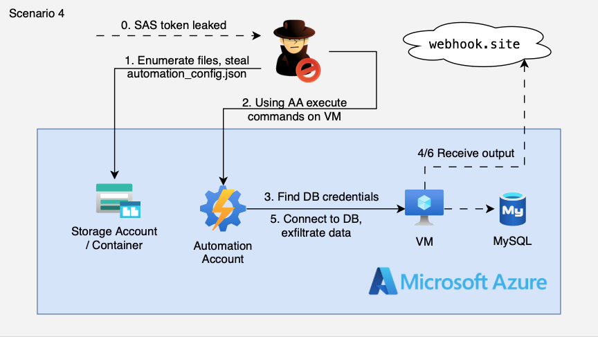

# 4. SAS Token Leak → Automation Account → VM → MySQL Database Exfiltration

## 🗺️ Overview
This scenario demonstrates a multi-stage Azure compromise that begins with a leaked Storage Account SAS token (simulating accidental exposure in documentation, CI/CD logs, or developer communications). The attacker uses the SAS token to enumerate storage containers and discovers an automation configuration file containing a webhook URL for an Azure Automation runbook. The runbook accepts arbitrary shell commands via its webhook endpoint — a dangerous anti-pattern. By invoking the webhook, the attacker executes commands on a target VM through Azure's Run Command feature. The VM has a Managed Identity with access to Key Vault, allowing the attacker to retrieve MySQL database credentials and ultimately exfiltrate sensitive data.

&nbsp;

## 🧩 Required Resources

**Storage**
- Storage Account with public blob container
- Automation configuration blob containing webhook URL and infrastructure details
- SAS token with read/list permissions (the "leaked" credential)

**Automation**
- Azure Automation Account with System-Assigned Managed Identity
- Vulnerable runbook accepting command parameter via webhook (Invoke-VMCommand)
- Automation webhook exposing the runbook endpoint

**Compute**
- Linux Virtual Machine (target for command execution)
- VM System-Assigned Managed Identity with Key Vault access

**Secrets**
- Azure Key Vault containing MySQL credentials
- MySQL connection string and admin password stored as secrets

**Database**
- Azure MySQL Flexible Server with sensitive database

&nbsp;

## 🎯 Scenario Goals
The attacker's objective is to leverage a leaked SAS token to discover automation infrastructure, exploit a vulnerable webhook-triggered runbook to execute arbitrary commands on a VM, use the VM's Managed Identity to access Key Vault secrets, and ultimately exfiltrate MySQL database credentials.

&nbsp;

## 🖼️ Diagram


&nbsp;

## 🗡️ Attack Walkthrough

### Phase 1: Initial Access
- **SAS Token Discovery** — Attacker finds leaked SAS token in documentation, logs, or public repository
- **Storage Enumeration** — Use SAS token to list containers and blobs in the storage account

### Phase 2: Configuration Discovery
- **Download Config Blob** — Retrieve `automation_config.json` containing sensitive infrastructure details
- **Extract Webhook URL** — Identify the Automation webhook URL for the `Invoke-VMCommand` runbook

### Phase 3: Command Execution
- **Invoke Webhook** — POST arbitrary shell command to the webhook endpoint
- **VM Command Execution** — Runbook executes command on target VM via `Invoke-AzVMRunCommand`

### Phase 4: Credential Theft
- **IMDS Token Request** — Execute command to request Key Vault token from VM's Managed Identity via IMDS
- **Key Vault Access** — Use the token to retrieve MySQL credentials from Key Vault

### Phase 5: Data Exfiltration
- **Database Connection** — Use stolen credentials to connect to MySQL server
- **Data Exfiltration** — Query and exfiltrate sensitive data from the database

&nbsp;

## 📈 Expected Results
**Successful Completion** — Starting from a leaked SAS token, the attacker chains storage enumeration, webhook exploitation, and Managed Identity abuse to retrieve database credentials and demonstrate full data exfiltration capability.

&nbsp;

## 🚀 Getting Started

#### Install Dependencies

macOS
```bash
brew install terraform azure-cli jq curl
```

Linux (Debian/Ubuntu)
```bash
sudo apt update && sudo apt install -y terraform jq curl
# Install Azure CLI: https://learn.microsoft.com/cli/azure/install-azure-cli
```

#### Deploy

Before deploying, ensure you are logged in with sufficient privileges to create resources.

```bash
az login
terraform init
terraform apply -auto-approve
```

After deployment, retrieve the "leaked" storage URL:

```bash
terraform output -raw leaked_storage_url
```

Save the URL — you will need it for the attack script.

For the full attack demo with credential exfiltration, create a free webhook endpoint at https://webhook.site and copy your unique URL.

#### Attack Execution

```bash
chmod +x attack.sh
./attack.sh
```

The script will:
1. Prompt for the leaked storage URL
2. Ask for a webhook.site URL (optional, for live credential exfiltration)
3. Execute the full attack chain including database access

#### Manual Database Testing

If the automated exfiltration doesn't work (e.g., timing issues), you can test database access manually:

```bash
# Get credentials from Terraform
terraform output mysql_host
terraform output -raw mysql_password

# Connect to database (requires mysql client)
mysql -h $(terraform output -raw mysql_host) -u mysqladmin -p'PASSWORD' sensitive
```

#### 🧹 Clean Up

When finished, destroy all resources:

```bash
terraform destroy -auto-approve
```

&nbsp;

## 🛡️ Detection Opportunities

This attack generates multiple detection signals across Azure services:

| Signal | Service | Description |
|--------|---------|-------------|
| SAS Token Usage | Storage Analytics | Blob access from unusual IP/location |
| Webhook Invocation | Automation Job Logs | Runbook triggered via webhook with command payload |
| Run Command Execution | Activity Log | Invoke-AzVMRunCommand on target VM |
| IMDS Token Request | (VM-level) | Token request for Key Vault resource |
| Key Vault Secret Access | Key Vault Audit Logs | Secret reads from VM Managed Identity |
| MySQL Connection | MySQL Audit Logs | Database connection from unexpected source |

&nbsp;

## 🔐 Remediation Guidance

1. **SAS Token Management**
   - Use short-lived SAS tokens with minimal permissions
   - Implement SAS token rotation policies
   - Monitor for SAS token usage from unexpected locations
   - Prefer Managed Identities over SAS tokens where possible

2. **Automation Security**
   - Never accept arbitrary commands via webhook parameters
   - Use parameterized runbooks with strict input validation
   - Implement webhook authentication and IP restrictions
   - Review runbook permissions and managed identity roles

3. **Managed Identity Permissions**
   - Apply least privilege to VM Managed Identities
   - Avoid broad Key Vault access — scope to specific secrets
   - Use Conditional Access policies where possible

4. **Monitoring & Alerting**
   - Alert on Automation webhook invocations with suspicious payloads
   - Monitor Run Command executions on VMs
   - Track Key Vault access patterns and alert on anomalies
   - Enable diagnostic logging for all services in the attack path
