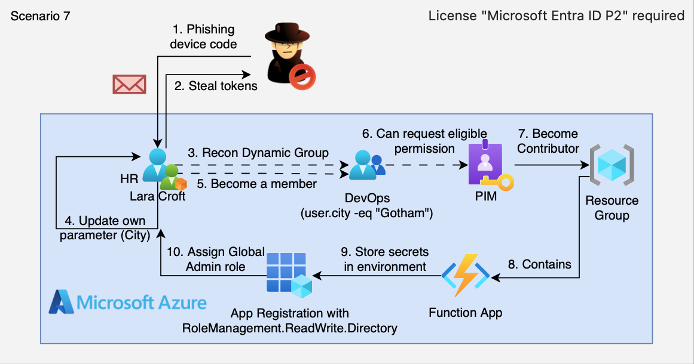

# 7. Phishing — Dynamic Group & PIM Abuse (OAuth Device Code)

## 🗺️ Overview
This scenario simulates a multi-stage Azure compromise that begins with a successful phishing campaign using the OAuth Device Code (device code) flow to capture authentication from an interactive user. After obtaining delegated tokens, the attacker performs post-phish enumeration using Microsoft Graph and abuses dynamic group membership to gain access to a privileged `DevOPS` dynamic group. The scenario demonstrates how dynamic membership rules, Application / Service Principal misconfigurations and PIM (Privileged Identity Management) eligibility can be chained to escalate privileges and gain access to resources. Finally the attacker attempts to activate a PIM role (Contributor), carry out resource discovery and harvest secrets and demonstrates app-only authentication using stolen credentials for proof. In some cases, compromised or over-privileged app registrations (client id/secret) that have been granted admin consent or excessive application permissions can be abused via app-only authentication to escalate tenant-wide privileges — potentially up to **Global Administrator** — depending on the permissions granted.

&nbsp;

## 🧩 Required Resources

**Azure AD / Identity**
- Azure AD tenant with users
- A dynamic group configured (e.g., `streamgoat-7-DevOPS`) using user attributes
- Azure PIM enabled with an eligibility policy for the DevOPS group
- App registration with delegated permissions used by a function (phishing landing)
- **Microsoft Entra ID P2 license** (required for Azure PIM and dynamic group functionality)

**Compute / Platform**
- Azure Function App used as a phishing landing (function package included)
- Resource Group to host lab resources

**Permissions**
- Minimal RBAC role to allow read-only PIM visibility for the DevOPS group
- Application permission for directory / role management used to demonstrate app-only flows

&nbsp;

## 🎯 Scenario Goals
The attacker’s objective is to phish an interactive user, escalate access via dynamic group membership and PIM eligibility, activate a privileged role (Contributor), and then perform resource discovery and secret harvesting to demonstrate access escalation and the implications for enterprise security monitoring.

&nbsp;

## 🖼️ Diagram


&nbsp;

## 🗡️ Attack Walkthrough
- **Phishing (Device Code)** – Launch OAuth Device Code flow and trick an interactive user into authenticating (steps 1a–1c).
- **Post-Phish Enumeration** – Use the delegated token to call Microsoft Graph and enumerate users, groups and memberships.
- **Dynamic Group Abuse** – Leverage a dynamic membership rule that adds the victim to the `DevOPS` group.
- **Group Exploitation** – Use group membership to trigger RBAC / PIM changes and discover eligible roles.
- **PIM Activation** – Request / activate a PIM role (Contributor) for the `DevOPS` group.
- **Resource Discovery & Secret Harvesting** – Use escalated privileges to enumerate subscriptions, roles, and identify secrets.
- **App-only Auth (Proof)** – Demonstrate app-only authentication using obtained credentials and enumerate permissions for proof of exploit; if an app registration has excessive application permissions or admin consent, this can enable tenant-wide escalation (up to **Global Administrator**) and is included to show the potential impact of overprivileged apps.

&nbsp;

## 📈 Expected Results
**Successful Completion** - An interactive user authenticates to the device code flow and the attacker can enumerate and abuse dynamic group membership and PIM to gain Contributor-level access to resources and extract proof artifacts.

&nbsp;

## 🚀 Getting Started

#### Install Dependencies

MacOS
```bash
brew install terraform azure-cli jq curl zip
```
Linux (Debian/Ubuntu)
```bash
sudo apt update && sudo apt install -y terraform jq curl zip
```
To install the Azure CLI follow official docs: https://learn.microsoft.com/cli/azure/install-azure-cli

#### Deploy

Before deploying, download the provided Terraform configuration and the `attack.sh` script to the machine where you will run the attack steps.

This scenario requires specifying a subscription ID when running Terraform:

```bash
terraform init
terraform apply -var="subscription_id=$(az account show --query id -o tsv)" -auto-approve
az ad app permission admin-consent --id "$(terraform output -raw devops_app_client_id)"
terraform output --json | jq -r '"User credentials for phishing simulation\nUsername: \(.lara_croft_credentials.value.user_principal_name)\nPassword: \(.lara_croft_credentials.value.password)"'
```

**Note about admin consent:** The `az ad app permission admin-consent --id "<app-id>"` command grants tenant-wide admin consent for the application's configured API permissions. This step must be executed by a tenant Global Administrator (or a role permitted to grant admin consent). If you cannot run this command, ask a tenant admin to grant consent via the Azure Portal or run the equivalent `az` command for you. After granting consent you can verify the app's granted permissions with `az ad app permission list --id <app-id>`.

At the end of the deployment Terraform will display output values (e.g. `devops_app_client_id` and test credentials for a lab user). Save these details — you will need them for the phishing and post-phish steps in the attack script.

#### Attack Execution
Execute the attack script from your local terminal and follow its interactive prompts when simulating the phishing flow.

```bash
chmod +x attack.sh
./attack.sh
```

**Note:** The Device Code flow requires a human in the loop to visit the verification URL and enter the user code printed by the script.

#### 🧹 Clean Up
When you are finished, destroy all resources to avoid ongoing costs. This will tear down the Function App, groups, application registrations and most RBAC/PIM objects created by the lab.

**Important:** The PIM eligibility resource created by this lab is configured with `lifecycle.prevent_destroy` to avoid accidental deletion. Because of that, you must remove the resource from the Terraform state (or delete the eligibility request manually in the Azure portal) before running `terraform destroy`, otherwise the destroy will fail.

Example commands:

```bash
# Remove the PIM eligibility resource from terraform state so destroy can proceed
terraform state rm azapi_resource.pim_contributor_eligibility
# Now destroy the rest of the resources
terraform destroy -var="subscription_id=$(az account show --query id -o tsv)" -auto-approve
```

If you prefer, you can manually delete the role eligibility request in the Azure portal (or via `az`), then run `terraform destroy` as usual.