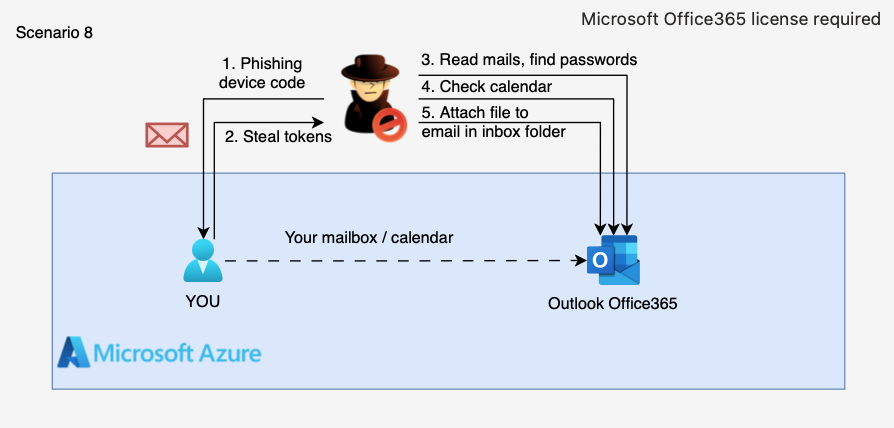

# 8. Phishing — OAuth Device Code & Mailbox Manipulation

## 🗺️ Overview
This scenario simulates a phishing attack using the OAuth Device Code flow to capture authentication tokens from an interactive user. After obtaining delegated Microsoft Graph tokens, the attacker performs post-compromise reconnaissance on the victim's Outlook mailbox — reading recent emails, searching for sensitive keywords (e.g., "password"), enumerating calendar events, and ultimately modifying an existing email by adding an attachment. This demonstrates how a successful phishing campaign can lead to mailbox compromise and manipulation, highlighting the risks of delegated token abuse in Microsoft 365 environments.

&nbsp;

## ⚠️ No Terraform Deployment

Unlike other CDRGoat scenarios, this scenario **does not include Terraform configuration** for infrastructure deployment. Setting up the required environment involves complex prerequisites that are challenging to automate:

- **Microsoft 365 / Office 365 subscription** with Exchange Online
- **Azure AD tenant** with properly licensed users
- **Microsoft Entra ID** configuration
- **Mailbox provisioning** and user setup

Since these requirements vary significantly across organizations and typically involve existing enterprise infrastructure, automated deployment is not practical.

&nbsp;

## ✅ Safe to Run on Real Infrastructure

This scenario is **safe to execute against real Microsoft 365 environments** for testing and training purposes:

- **No destructive operations** — The script only reads mailbox data and adds a benign test attachment
- **No credential theft** — Tokens are used only during the session and not persisted or exfiltrated
- **No malware** — The uploaded attachment contains only a harmless text file for simulation
- **Reversible changes** — The added attachment can be easily removed from the email
- **Audit trail** — All operations are logged in Microsoft 365 audit logs for review

The attack script is designed for **detection validation** and **SOC training**, allowing defenders to observe realistic attacker behavior in a controlled manner.

&nbsp;

## 📋 Disclosure Notice

The ability to **modify existing emails in a user's Inbox** (specifically, adding attachments to received messages via Microsoft Graph API) was reported to the **Microsoft Security Response Center (MSRC)** under case **VULN-171140**. While reading mailbox contents is expected behavior for delegated Mail permissions, the capability to alter emails that were sent by others appears abnormal and could be abused for post-compromise persistence or social engineering. Microsoft reviewed the submission and determined that this behavior **does not constitute a security boundary violation**. This highlights the need for detection mechanisms that can identify unusual mailbox modification patterns.

&nbsp;

## 🧩 Required Resources

**Microsoft 365 / Azure AD**
- Azure AD tenant with at least one licensed user
- Microsoft 365 subscription with Exchange Online (mailbox access)
- User account for phishing simulation (victim)

**Local Machine (Attacker)**
- Terminal with bash support
- `curl`, `jq`, and `zip` utilities installed

&nbsp;

## 🎯 Scenario Goals
The attacker's objective is to phish an interactive user via OAuth Device Code flow, obtain delegated Microsoft Graph tokens, perform mailbox reconnaissance (reading emails, searching for credentials, enumerating calendar), and demonstrate post-compromise manipulation by adding an attachment to an existing email.

&nbsp;

## 🖼️ Diagram


&nbsp;

## 🗡️ Attack Walkthrough
- **Step 1. Phishing (Device Code)** — Launch OAuth Device Code flow and trick an interactive user into authenticating. The victim visits `microsoft.com/devicelogin` and enters the displayed code.
- **Step 2. Mailbox Access** — Use the delegated token to query the victim's Outlook Inbox and retrieve recent messages with numbered IDs for later selection.
- **Step 3. Credential Hunting** — Search the mailbox for messages containing sensitive keywords (e.g., "password") to identify potential credential exposure.
- **Step 4. Calendar Recon** — Enumerate upcoming calendar events to gather intelligence on meetings, attendees, and schedules.
- **Step 5. Email Modification** — Select an email from the harvested list and add an attachment to demonstrate mailbox manipulation capabilities.

&nbsp;

## 📈 Expected Results
**Successful Completion** — An interactive user authenticates to the device code flow, and the attacker can read mailbox contents, search for sensitive data, enumerate calendar events, and modify an existing email by adding an attachment.

&nbsp;

## 🚀 Getting Started

#### Install Dependencies

macOS
```bash
brew install jq curl zip
```

Linux (Debian/Ubuntu)
```bash
sudo apt update && sudo apt install -y jq curl zip
```

#### Attack Execution

No infrastructure deployment is required. Execute the attack script directly and follow its interactive prompts:

```bash
chmod +x attack.sh
./attack.sh
```

The script will:
1. Generate a device code and display instructions for the victim
2. Wait for the victim to complete authentication
3. Perform mailbox reconnaissance and display results
4. Prompt you to select an email for attachment modification

**Note:** The Device Code flow requires a human in the loop to visit the verification URL and enter the user code printed by the script. Use an incognito/private browser window for the victim simulation.

#### 🧹 Clean Up

After completing the scenario:
1. Open the victim's mailbox in Outlook
2. Locate the modified email (the one you selected in Step 5)
3. Remove the timestamped attachment (e.g., `2026_01_21-14_35_22-phish-upload.zip`)
4. Optionally, revoke the OAuth session from Azure AD → Users → Sign-in activity
