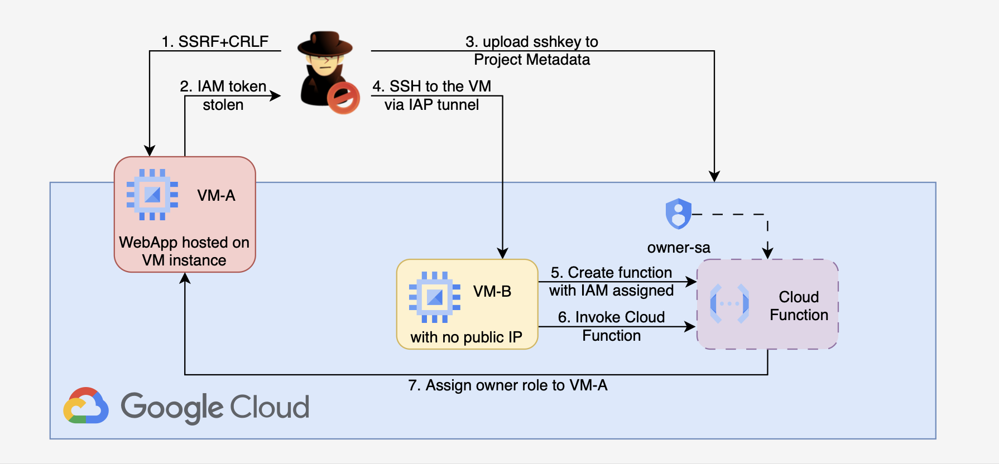

# 2. SSRF+CRLF on VM to Cloud Function Privilege Escalation

## 🗺️ Overview
This scenario demonstrates how an attacker can chain a vulnerability in a public-facing VM instance with overly permissive IAM and Cloud Function roles to achieve full GCP account takeover. The attack begins with exploitation of an SSRF+CRLF vulnerability in VM-A’s web application to access the Instance Metadata Service and steal temporary IAM role credentials. With these credentials, the attacker pivots into an internal VM-B via injection into project level Metadata, then abuses excessive permissions under Cloud Function, to create and invoke a malicious function with Owner role. The Cloud Function is used to assign owner privileges to a IAM user under the attacker’s control, granting persistent, account-wide access. This exercise highlights the dangers of SSRF exploitation, weak IAM hygiene, and privilege escalation through misconfigured Cloud Function execution roles.

&nbsp;

## 🧩 Required Resources

**Networking**
- 1 default network, single region
- Subnets - 1 private

**Compute**
- VM-A - Public web server (vulnerable web application, internet-facing)
- VM-B - Second instance for internal purposes but internet-facing

**IAM / Service Accounts and Roles**
- Service Accounts assigned to VM-A with permissions to modify project Metadata
- Service Accounts assigned to VM-B with permissions to create and invoke Cloud Function on behalf of other Role

&nbsp;

## 🎯 Scenario Goals
Demonstrate how an SSRF vulnerability can be leveraged to gain GCP credentials, pivot to an internal system via project Metadata, and escalate to full account compromise through misconfigured IAM and Cloud Function privileges.

&nbsp;

## 🖼️ Diagram


&nbsp;

## 🗡️ Attack Walkthrough
- **Initial Access** - Exploit SSRF+CRLF in VM-A’s application to access the Instance Metadata Service and obtain IAM role credentials.
- **Lateral Movement** - Use stolen VM-A credentials to issue inject into project Metadata and start a session on VM-B.
- **Privilege Escalation** - From VM-B create a new Cloud Function function on behalf of Owner role.
- **Full Compromise** - Invoke the Lambda to assign Owner role on previously compromised Service Account.

&nbsp;

## 📈 Expected Results
**Successful Completion** - Administrative IAM user created with full account privileges.

&nbsp;

## 🚀 Getting Started

#### Install Dependencies
macOS
```bash
brew install terraform jq
```
Linux
```bash
sudo apt update && sudo apt install -y terraform jq
```

To install **gcloud** cli tool please check official documentation: https://docs.cloud.google.com/sdk/docs/install

### 🏗️ Deploy
Before deploying, download the provided Terraform configuration and Attack Script to the machine where you will run the attack steps.

Use the provided Terraform configuration to deploy the full lab environment.

At the end of the deployment Terraform will display output values such as the public IP address of the target instance. Save these details, you will need them to run the attack script in the next stage.

⚠️ When a scenario’s initial step targets a public IP, add the public IP (or CIDR) of the machine that will run the attack script to the environment whitelist via terraform apply so the script can reach the target and complete any required interactions. See example

```bash
terraform init
terraform apply -var='attack_whitelist=["87.68.140.7/32","203.0.113.0/24"]' -auto-approve
```

#### 🎯 Attack Execution
Execute the attack script from your local terminal and use the output values provided at the end of the deployment as input parameters.

```bash
chmod +x attack.sh
./attack.sh
```

#### 🧹 Clean Up
When you are finished, destroy all resources to avoid ongoing costs. This will tear down the entire lab environment including all compute, networking, and IAM components created during deployment.

Use the following command for a full cleanup
```bash
terraform destroy -var='attack_whitelist=[]' -auto-approve
```