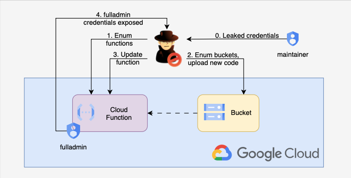

# 3. Cloud Function Enumeration & IAM Privilege Escalation

## 🗺️ Overview
This scenario demonstrates how a moderately-privileged service account with the ability to update Cloud Functions and write to Cloud Storage can be abused to achieve full project compromise. An attacker starts with a leaked or otherwise compromised service account key, enumerates Cloud Functions and buckets, uploads malicious function code into a writable bucket, and patches a Cloud Function that runs as a highly privileged service account. When invoked, the modified function exposes the service account’s access token, which the attacker uses to read the project IAM policy and confirm/abuse Owner-level privileges.

This scenario highlights how: insecure function update controls, writable storage, and overly-permissive service-account roles can be chained to escalate privileges in GCP.

The important part in this scenario that having writable bucket in the target project is very optional. For function deployment attacker may use any other public bucket he controls. 

&nbsp;

## 🧩 Required Resources

**Storage**
- GCS bucket for Cloud Function source uploads (created by Terraform)

**Serverless**
- Cloud Function `streamgoat-calc-function` (runs as `streamgoat-sa-fulladmin`)

**IAM / Service Accounts & Roles**
- `streamgoat-sa-maintainer` — has a custom `streamgoatRoleMaintainer` role that includes permissions such as:
  - cloudfunctions.functions.get, list, invoke, update, sourceCodeSet
  - iam.roles.list, iam.roles.get
  - iam.serviceAccounts.list, iam.serviceAccounts.get, iam.serviceAccounts.actAs
  - storage.buckets.list, storage.objects.get, storage.objects.create
- `streamgoat-sa-fulladmin` — assigned `roles/owner` for the project (high-privilege account)

&nbsp;

## 🎯 Scenario Goals
Show how a compromised service account with function update and storage write permissions can be used to inject code into a Cloud Function that runs as a more-privileged service account, enabling token theft, IAM policy enumeration, and project-level compromise.

&nbsp;

## 🖼️ Diagram


&nbsp;

## 🗡️ Attack Walkthrough
- **Initial Access** - Attacker obtains a base64-encoded JSON service account key (Terraform outputs this key during deploy).
- **Enumeration** - Use the key to authenticate and list Cloud Functions, service accounts and GCS buckets.
- **Discovery** - Identify Function and note it runs as privileged IAM (project Owner), locate a writable bucket.
- **Weaponization** - Upload a ZIP containing a small function that calls the metadata service from inside the Cloud Function runtime to obtain the function’s service account token and identity.
- **Code Injection** - Patch the target Cloud Function to point to the uploaded ZIP and change entrypoint to the malicious handler.
- **Token Theft** - Invoke the function to retrieve the privileged service account token.
- **Post-exploitation** - Use the stolen token to call the Cloud Resource Manager API (e.g., getIamPolicy) and enumerate/abuse project roles.

&nbsp;

## 📈 Expected Results
**Successful Completion** - The attacker extracts an access token for privileged IAM (Owner), uses it to read the project IAM policy and confirm Owner privileges, and therefore can perform project-wide administrative actions.

&nbsp;

## 🚀 Getting Started

#### Install Dependencies
macOS
```bash
brew install terraform gcloud jq curl zip
```
Linux
```bash
sudo apt update && sudo apt install -y terraform jq curl zip
```

To install the **gcloud** CLI please check the official documentation: https://docs.cloud.google.com/sdk/docs/install

### 🏗️ Deploy
Before deploying, make sure you are in this scenario directory and authenticated to a GCP project where you want to deploy the lab.

```bash
terraform init
terraform apply -auto-approve
```
#### 📝 Get Output Values
Execute the commands below to collect the values that will serve as the attack script’s starting inputs
```bash
terraform output --json | jq -r '"SERVICE KEY: \(.maintainer_service_account_key_json.value)"'
```

At the end of the deployment Terraform will output values you will need to run the attack script, including a base64-encoded private key.

Retrieve the base64-encoded maintainer key (you will paste this into `attack.sh` when prompted):

#### 🎯 Attack Execution
Run the attack automation from your local terminal, and when prompted paste the base64-encoded maintainer key (from the Terraform output above):

```bash
chmod +x attack.sh
./attack.sh
```

Follow on-screen prompts. The script will authenticate using the supplied key, enumerate functions and buckets, upload a malicious ZIP to the writable bucket, patch the target function, invoke it and display the returned token and IAM roles discovered.

#### 🧹 Clean Up
When finished, destroy all resources to avoid ongoing costs:

```bash
terraform destroy -auto-approve
```

---

**Note:** This lab is intentionally vulnerable. Do not run these steps in a production project or against any account you don't own. Use an isolated, disposable GCP project for testing.
