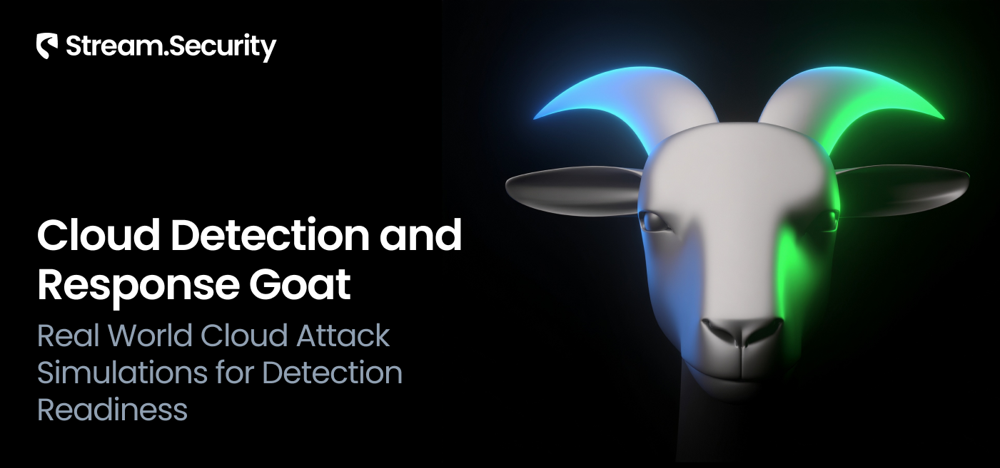

Cloud adoption has reshaped the enterprise attack surface, where adversaries can chain misconfigurations, excessive permissions, and runtime blind spots into full compromises.  
**Cloud Detection & Response GOAT** is a scenario-driven, intentionally vulnerable framework designed to help defenders validate detection pipelines, practice SOC workflows and train analysts on realistic cloud attack paths - all in a safe, reproducible environment with no impact on production.  

CDR GOAT enables:
- **Advanced simulations** - Misconfigurations combined with live attacker behavior (privilege escalation, credential theft, lateral movement).  
- **Detection & response validation** - Confirm alerts fire, understand context, and rehearse investigation workflows under realistic pressure.  
- **SOC readiness** - Train analysts on real signals instead of abstract examples.  
- **Purple teaming** - Run adversary emulation while measuring blue team effectiveness in real time.  

&nbsp;

## ⚠️ Warning
- Do **not** deploy to production
- Use only isolated sandbox/test accounts
- Expect cloud usage costs while resources are running
- Always destroy resources after finishing a scenario

&nbsp;

## ✨ Features
- **Scenario‑driven attack paths** - Reproducible simulations of real‑world adversary tactics in cloud environments (IAM abuse, SSRF, privilege escalation, data exfiltration, etc.).
- **Safe to run** - Resources are provisioned in isolated test accounts with minimal blast radius.
- **Automated Attack Script** - A fully automated script to execute attacks end-to-end, reducing manual steps and ensuring repeatable outcomes.

&nbsp;

## 🚀 Getting Started

#### 🧩 Prerequisites
- Terraform ver. 1.5 or above
- AWS account (sandbox recommended, do not run in production)  
- AWS CLI configured with appropriate credentials  
- jq utility for parsing JSON output  

#### ⚙️ Install Dependencies
macOS
```bash
brew install terraform awscli jq
```
Linux
```bash
sudo apt update && sudo apt install -y terraform awscli jq
```

#### 🗂️ Simulation Scenarios
The simulation scenarios are organized by folder under `scenarios/`.  
Each folder includes:  
- A **Terraform plan** to provision the environment for the scenario.  
- An **attack script** that automates the attack path, allowing defenders to focus on detection and response.  

Navigate into a scenario folder to run Terraform and execute the attack script as described below.

#### 🏗️ Deploy
Before deploying, download the provided Terraform configuration and attack script to the machine where you will run the attack steps.

Use the provided Terraform configuration to deploy the full lab environment.

At the end of the deployment Terraform will display output values (such as the public IP of the target instance). Save these details, you will need them when running the attack script.
Some of this information might be sensitive and thus reducted by Terraform.
In order to reveal specific output we can use `terraform output` command.

For example to get output value of `leaked_user_secret_access_key` we can execute following:

```bash
terraform output leaked_user_access_key_id
```

⚠️ When a scenario’s initial step targets a public IP, add the public IP (or CIDR) of the machine that will run the attack script to the environment whitelist via terraform apply so the script can reach the target and complete any required interactions. See example

```bash
terraform init
terraform apply -var='attack_whitelist=["87.68.140.7/32","203.0.113.0/24"]' -auto-approve
```

#### 🎯 Attack Execution
Since our focus is on the defender’s perspective, each scenario includes a **fully automated attack script**. Instead of manually typing commands, the script replays the attack path so you can observe detections and signals.
You may be prompted to provide inputs (e.g., your external IP). These are always displayed at the end of the Terraform deployment.

```bash
chmod +x attack.sh
./attack.sh
```


#### 🧹 Clean Up
When you are finished, destroy all resources to avoid ongoing costs. This will tear down the entire lab environment including all compute, networking, and IAM components created during deployment.

```bash
terraform destroy -var='attack_whitelist=[]' -auto-approve
```

&nbsp;

## 📖 Usage Guide
Terraform commands you’ll use most often:  

```bash
terraform init      # prepare the working directory
terraform apply     # deploy a scenario
terraform destroy   # clean up resources
```

&nbsp;
***
&nbsp;

## Contributing
We welcome contributions! You can submit pull requests for:  
- New scenarios  
- Bug fixes  
- Documentation improvements
  
&nbsp;
## 💰 Cost
Each scenario is designed with minimal cloud resources to reduce expenses and limit blast radius.  
However, costs may still accrue while environments are running. To avoid unnecessary charges, always shut down and destroy the environment when you are finished.

&nbsp;

## 👥 Contributors
- Petr Zuzanov - Principal Security Researcher, Stream Security
- David Moss – Product Manager, Stream Security

&nbsp;

## ⚖️ Disclaimer
This content is provided for educational and informational purposes only. Stream Security’s CDRGoat is provided as-is without warranties of any kind. By using this project you accept full responsibility for all outcomes. Scenarios are intentionally vulnerable and must only be deployed in isolated, non-production accounts. Stream Security does not guarantee the accuracy or completeness of the content and assumes no liability for any damages resulting from its use.
Stream Security does not endorse or condone any illegal activity and disclaims any liability arising from misuse of the material. Stream Security and project contributors assume no liability for misconfiguration or unintended consequences, including any illegal activity. Ensuring safe and appropriate use is your responsibility.
