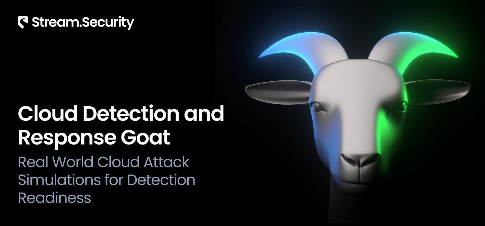
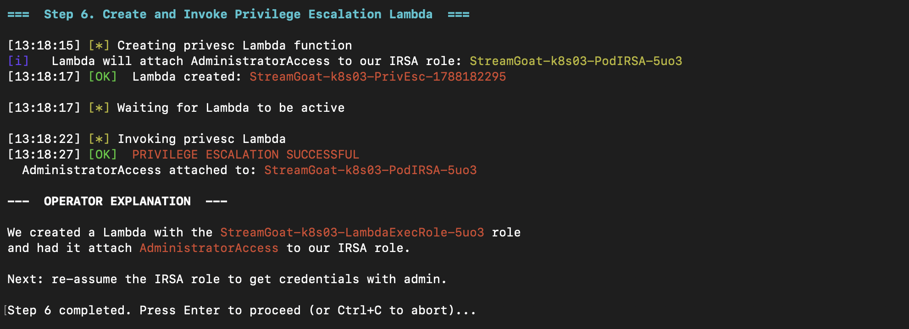

**Can your SOC detect a real attack? How fast can it respond?**
CDRGoat is an open-source framework of intentionally vulnerable cloud environments that let defenders answer these questions with real signals, not theory. Deploy a scenario, run the automated attack, and measure what your detection pipeline catches - and what it misses.

As attackers adopt AI-driven tooling to move faster and chain exploits more creatively, the pressure on detection and response teams grows. CDRGoat helps SOC teams validate their readiness against both traditional and AI-powered attack patterns across the full cloud stack - from IAM abuse and container escapes to prompt injection and LLM-assisted privilege escalation.

&nbsp;

## ⚠️ CDRGoat Warning
- Do **not** deploy to production
- Use only isolated sandbox/test accounts
- Expect cloud usage costs while resources are running
- Always destroy resources after finishing a scenario

&nbsp;

## 🌐 CDRGoat Supported Domains

| Domain | Techniques |
|--------|------------|
| **AWS** | RCE, SSRF, IAM privesc, credential theft, data exfiltration, defense evasion |
| **Azure** | RCE, LFI, App Registration abuse, SAS token theft, managed identity privesc |
| **GCP** | RCE, SSRF, service account impersonation, Cloud SQL pivot |
| **Kubernetes** | Container escape, kernel rootkit, RBAC escalation, east-west lateral movement, audit bypass, etcd injection |
| **AI** | Prompt injection, LLM-assisted SQLi, data exfiltration via AI agent |

Every scenario is self-contained with its own README, deployment instructions, and a fully automated attack script.

&nbsp;

## ✨ CDRGoat Features
- **Realistic attack paths** - Multi-step chains across cloud providers, Kubernetes clusters, and AI agents (privilege escalation, credential theft, lateral movement, persistence, defense evasion).
- **Automated attack scripts** - Each scenario includes a script that replays the full attack path, so defenders can focus on detection and response rather than manual exploitation.
- **SOC self-assessment** - Validate whether your detection pipeline catches real attacker behavior, measure response time, and identify blind spots.
- **AI-era readiness** - Test your defenses against scenarios that reflect how AI-assisted attackers operate: faster reconnaissance, smarter prompt injection, and automated exploit chains.
- **Purple teaming** - Run adversary emulation while measuring blue team effectiveness in real time.

&nbsp;

## 🚀 CDRGoat Getting Started

Each scenario has its own directory with a README covering prerequisites, deployment, and cleanup:

```
AWS/     (Terraform + attack.sh)
Azure/   (Terraform + attack.sh)
GCP/     (Terraform + attack.sh)
k8s/     (kubectl/Terraform + attack.sh)
AI/      (Terraform + attack.sh)
```

Pick a scenario, follow its README, and run the attack script:

```bash
chmod +x attack.sh
./attack.sh
```



&nbsp;

## CDRGoat Contributing
We welcome contributions! You can submit pull requests for:
- New scenarios
- Bug fixes
- Documentation improvements

&nbsp;

## 💰 CDRGoat Cost
Each scenario uses minimal cloud resources to reduce expenses and limit blast radius.
Costs may still accrue while environments are running. Always destroy resources when you are finished.

&nbsp;

## 👥 CDRGoat Contributors
- Petr Zuzanov - Principal Security Researcher, Stream Security
- David Moss - Product Manager, Stream Security

&nbsp;

## ⚖️ CDRGoat Disclaimer
This content is provided for educational and informational purposes only. Stream Security's CDRGoat is provided as-is without warranties of any kind. By using this project you accept full responsibility for all outcomes. Scenarios are intentionally vulnerable and must only be deployed in isolated, non-production accounts. Stream Security does not guarantee the accuracy or completeness of the content and assumes no liability for any damages resulting from its use.
Stream Security does not endorse or condone any illegal activity and disclaims any liability arising from misuse of the material. Stream Security and project contributors assume no liability for misconfiguration or unintended consequences, including any illegal activity. Ensuring safe and appropriate use is your responsibility.
