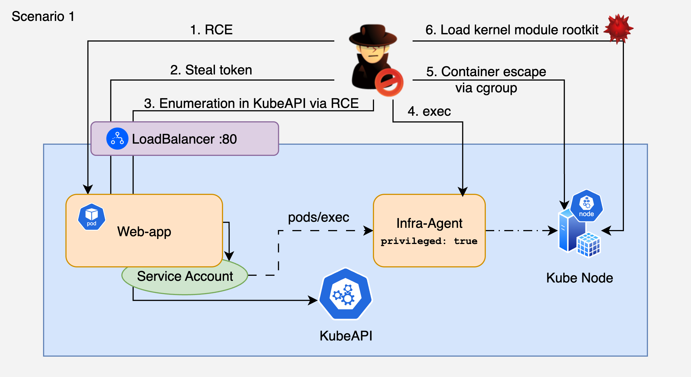

# 1. RCE on Web App to Container Escape to Kernel Rootkit to Cloud Pivot

## 🗺️ Overview
This scenario demonstrates a multi-stage Kubernetes compromise starting from a Remote Code Execution (RCE) vulnerability in a public-facing Flask application. The attacker exploits the web app to gain a foothold, discovers an over-privileged pod via the Kubernetes API, pivots into it, performs a container escape, and loads a kernel module rootkit onto the node to establish persistent, invisible access. The rootkit provides an ICMP-triggered reverse shell for covert re-entry and survives pod restarts via modules-load.d persistence. Finally, the attacker steals cloud credentials from IMDS.

This exercise highlights the full kill chain from initial web exploit to persistent kernel-level node compromise, demonstrating how exposed web applications, privileged pod specs, and the ability to load kernel modules can be chained into an attack that survives remediation of the original entry point. Inspired by the [Singularity rootkit](https://github.com/MatheuZSecurity/Singularity) research.

**Entry point:** Vulnerable Flask app with `/cmd` endpoint exposed via LoadBalancer

&nbsp;

## 🧩 Required Resources

**Kubernetes**
- 1 Namespace (`cdrgoat-sc01`)
- ServiceAccount with `list/get pods` + `create pods/exec` permissions
- Role + RoleBinding granting SA permissions
- ConfigMap with Flask application source code
- 2 Pods:
  - `web-app` - Vulnerable Flask app with `/cmd` RCE endpoint (python:3.11-slim)
  - `infra-agent` - Privileged pod simulating a monitoring agent (ubuntu:22.04, `privileged: true`)
- Service (LoadBalancer) exposing web-app on port 80
- NetworkPolicy restricting ingress to attacker IP

**Cloud extras (EKS variant)**
- Node IAM role with `s3:ListBuckets`, `cloudtrail:StopLogging` (intentionally over-permissioned)
- No IRSA configured on pods (inherits node role)

&nbsp;

## 🎯 Scenario Goals
The attacker's objective is to exploit a public-facing web application to gain code execution, pivot through the Kubernetes cluster to escape the container, load a kernel rootkit for persistent node-level access, and steal cloud credentials from IMDS.

&nbsp;

## 🖼️ Diagram


&nbsp;

## 🗡️ Attack Walkthrough
- **Initial Access** - Exploit command injection on the Flask app's `/cmd` endpoint to achieve RCE.
- **Reconnaissance** - Read OS info, environment variables, and steal the mounted ServiceAccount token.
- **Cluster Enumeration** - Use the SA token to query the internal K8s API, enumerate permissions, discover the privileged `infra-agent` pod, and download `kubectl` into the compromised pod.
- **Lateral Movement** - Use `pods/exec` permission to pivot into the privileged `infra-agent` pod.
- **Container Escape** - Mount cgroupfs and exploit the release_agent technique (cgroupv1), or fall back to direct host device mount (cgroupv2) to access the host filesystem.
- **Kernel Rootkit** - Compile a kernel module with a netfilter ICMP hook via `chroot /host`, load it with `insmod`. The rootkit listens for ICMP packets with 1337-byte payload to trigger a reverse shell via `call_usermodehelper()`.
- **Persistence** - Write module name to `/etc/modules-load.d/` and run `depmod` so the rootkit reloads on node reboot.
- **ICMP Trigger** - Ping the node with `-s 1337` from the controlled pod to trigger the rootkit's reverse shell.
- **Kubelet Credentials** - Read the kubelet kubeconfig from the host filesystem.
- **IMDS Credential Theft** - Query the Instance Metadata Service for the node's IAM role credentials (IMDSv2 token flow).
- **Cloud API Abuse** - Use stolen credentials to enumerate S3 buckets, attempt `cloudtrail:StopLogging` and `ec2:DeleteFlowLogs`.

&nbsp;

## 📈 Expected Results
**Successful Completion** - Kernel rootkit loaded and armed, ICMP reverse shell triggered, cloud credentials stolen from IMDS, cloud API abuse demonstrated.

&nbsp;

## 🚀 Getting Started

#### Install Dependencies
The attack machine needs only `curl` and `jq`. No `kubectl`, no `kubeconfig`, no cluster access required for the attack.

MacOS
```bash
brew install curl jq
```
Linux
```bash
sudo apt update && sudo apt install -y curl jq
```

#### Deploy
Use `kubectl` (from a machine with cluster access) to deploy the vulnerable environment:

```bash
# Edit deploy.yaml - replace 0.0.0.0/0 with your IP:
#   cidr: $(curl -s ifconfig.me)/32

kubectl apply -f deploy.yaml

# Wait for pods to be ready (~60s for pip install)
kubectl get pods -n cdrgoat-sc01 -w

# Get the LoadBalancer IP/hostname
kubectl get svc web-app-svc -n cdrgoat-sc01

# On-prem / minikube / kind - if EXTERNAL-IP stays <pending>:
kubectl port-forward svc/web-app-svc -n cdrgoat-sc01 8080:80 &
# then use localhost:8080 as the target in attack.sh
```

#### Attack Execution
Execute the attack script from the attacker machine using the LoadBalancer IP/hostname as input:

```bash
chmod +x attack.sh
./attack.sh
```

#### 🧹 Clean Up
When finished, destroy all resources:

```bash
kubectl delete -f deploy.yaml
```

To remove rootkit artifacts from the node (requires host access):
```bash
rmmod cdrgoat_rootkit
rm -f /etc/modules-load.d/cdrgoat_rootkit.conf
rm -rf /lib/modules/*/kernel/drivers/misc/cdrgoat*
rm -rf /tmp/cdrgoat_lkm /tmp/.hidden_cdrgoat
depmod
```
