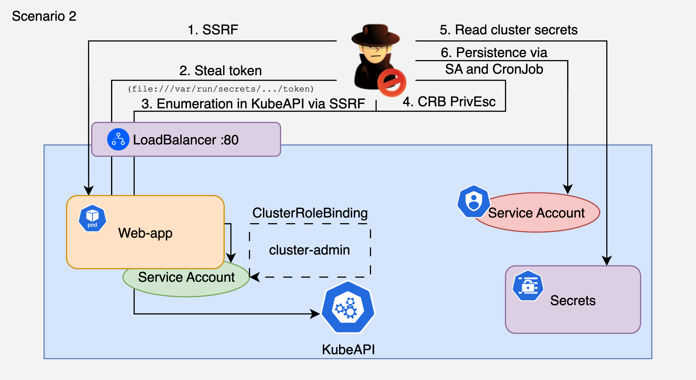

# 2. SSRF on Web App to RBAC Escalation to Secret Exfil to Persistence

## 🗺️ Overview
This scenario demonstrates how an attacker chains a Server-Side Request Forgery (SSRF) vulnerability in a public-facing Flask application with overly permissive RBAC to achieve full cluster compromise and persistent access. The attacker uses SSRF with `file://` protocol to read the pod's ServiceAccount token (LFI), then proxies requests to the internal Kubernetes API through the same SSRF endpoint. The SA has permission to create ClusterRoleBindings - a single API call escalates to cluster-admin. With full cluster access, the attacker dumps secrets from all namespaces, creates a backdoor ServiceAccount in kube-system disguised as a legitimate controller, and deploys a self-healing CronJob that re-creates the backdoor if deleted.

**Entry point:** Flask app with `/fetch?url=` proxy endpoint exposed via LoadBalancer

&nbsp;

## 🧩 Required Resources

**Kubernetes**
- 2 Namespaces (`cdrgoat-sc02` for the app, `cdrgoat-sc02-prod` for target secrets)
- ServiceAccount with overly broad ClusterRole: list pods/services/namespaces, list/get secrets, create clusterrolebindings, create serviceaccounts, create cronjobs
- 1 Pod: `web-app` - Flask app with SSRF-vulnerable `/fetch` endpoint (python:3.11-slim)
- Service (LoadBalancer) exposing web-app on port 80
- NetworkPolicy restricting ingress to attacker IP
- Planted secrets in production namespace (database credentials, API keys)

&nbsp;

## 🎯 Scenario Goals
The attacker's objective is to exploit an SSRF vulnerability to steal the pod's ServiceAccount token, escalate to cluster-admin via RBAC misconfiguration, exfiltrate secrets from production namespaces, and establish persistent backdoor access that survives remediation of the original vulnerability.

&nbsp;

## 🖼️ Diagram


&nbsp;

## 🗡️ Attack Walkthrough
- **SSRF Discovery** - Probe the `/fetch` endpoint and confirm `file://` protocol support.
- **Token Theft via LFI** - Use `file:///var/run/secrets/kubernetes.io/serviceaccount/token` through the SSRF to steal the SA JWT token.
- **Permission Enumeration** - Proxy SelfSubjectRulesReview and SelfSubjectAccessReview requests to the internal K8s API through the SSRF. Discover the SA can create ClusterRoleBindings.
- **RBAC Escalation** - Create a ClusterRoleBinding that binds the compromised SA to the built-in cluster-admin ClusterRole. One API call for full cluster control.
- **Secret Exfiltration** - Dump secrets from all namespaces including database credentials and API keys from the production namespace.
- **Backdoor SA** - Create a ServiceAccount named `system-controller` in kube-system with cluster-admin binding. Name and labels mimic a legitimate controller component.
- **CronJob Persistence** - Deploy a CronJob that runs every 5 minutes, checks if the backdoor SA exists, and re-creates it if deleted. Self-healing persistence.

&nbsp;

## 📈 Expected Results
**Successful Completion** - Escalated to cluster-admin, production secrets exfiltrated, backdoor SA and self-healing CronJob deployed in kube-system.

&nbsp;

## 🚀 Getting Started

#### Install Dependencies
The attack machine needs only `curl` and `jq`.

MacOS
```bash
brew install curl jq
```
Linux
```bash
sudo apt update && sudo apt install -y curl jq
```

#### Deploy
Use `kubectl` (from a machine with cluster access) to deploy the vulnerable environment:

```bash
# Edit deploy.yaml - replace 0.0.0.0/0 with your IP:
#   cidr: $(curl -s ifconfig.me)/32

kubectl apply -f deploy.yaml

# Wait for pod to be ready (~60s for pip install)
kubectl get pods -n cdrgoat-sc02 -w

# Get the LoadBalancer IP/hostname
kubectl get svc web-app-svc -n cdrgoat-sc02
```

#### Attack Execution
Execute the attack script from the attacker machine:

```bash
chmod +x attack.sh
./attack.sh
```

#### 🧹 Clean Up
When finished, destroy all resources:

```bash
kubectl delete -f deploy.yaml

# Remove backdoor artifacts (created by the attack, not in deploy.yaml)
kubectl delete cronjob system-health-check -n kube-system
kubectl delete clusterrolebinding system-controller-binding
kubectl delete clusterrolebinding cdrgoat-escalation-crb
kubectl delete sa system-controller -n kube-system
```
