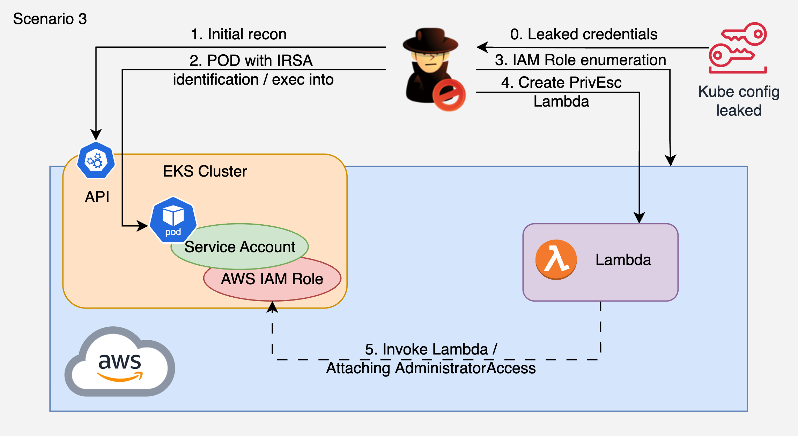

# 3. Leaked Kubeconfig to IRSA Credential Theft to Lambda PrivEsc

## 🗺️ Overview
This scenario demonstrates a multi-stage compromise starting from a leaked Kubernetes kubeconfig file (simulating accidental exposure in a public repository, CI/CD logs, or developer workstation). The attacker authenticates to the cluster, discovers a pod with an IRSA-assigned IAM role, execs into it, steals the IRSA credentials (web identity token), and pivots into AWS to perform IAM privilege escalation via a malicious Lambda function - achieving full account administrator access.

Unlike IMDS-based credential theft (where the actor appears as the generic node role), IRSA credentials are traceable in CloudTrail to the specific Kubernetes ServiceAccount via `webIdFederationData`. This makes the attack more detectable but equally dangerous if the IRSA role is over-permissioned.

**Entry point:** Leaked kubeconfig file (no vulnerable app needed)

&nbsp;

## 🧩 Required Resources

**Kubernetes**
- EKS cluster with OIDC provider configured
- ServiceAccount with `list pods/namespaces`, `exec pods` permissions
- SA annotated with IRSA role (`eks.amazonaws.com/role-arn`)
- 1 Pod: `backend-app` - application pod with IRSA credentials injected

**AWS IAM (deployed via Terraform)**
- IRSA role for the pod with `lambda:CreateFunction`, `lambda:InvokeFunction`, `iam:PassRole`, IAM enumeration permissions
- Lambda execution role with `iam:AttachRolePolicy` (the privilege escalation vector)

&nbsp;

## 🎯 Scenario Goals
The attacker's objective is to use a leaked kubeconfig to access the cluster, steal IRSA credentials from a pod, and escalate to full AWS account admin through a Lambda privilege escalation chain.

&nbsp;

## 🖼️ Diagram


&nbsp;

## 🗡️ Attack Walkthrough
- **Leaked Credentials** - Authenticate to the cluster using the leaked kubeconfig file.
- **Cluster Recon** - Enumerate namespaces, pods, permissions. Discover pods/exec capability.
- **Find IRSA Target** - Identify a pod with an IRSA annotation (AWS IAM role attached to the SA).
- **Pod Exec** - kubectl exec into the target pod to get a shell.
- **IRSA Theft** - Read the web identity token from the pod and call `sts:AssumeRoleWithWebIdentity` to get AWS credentials.
- **IAM Enumeration** - Use stolen credentials to enumerate IAM roles and policies. Discover a role with `iam:AttachRolePolicy`.
- **Lambda PrivEsc** - Create a Lambda function with the dangerous role. Invoke it to attach AdministratorAccess to the IRSA role.
- **Account Takeover** - Re-assume the IRSA role with admin permissions. Verify full access.

&nbsp;

## 📈 Expected Results
**Successful Completion** - IRSA role elevated to AdministratorAccess, full account compromise verified.

&nbsp;

## 🚀 Getting Started

#### Install Dependencies
The attack machine needs `kubectl`, `aws` CLI, `eksctl`, and `jq`.

MacOS
```bash
brew install kubectl awscli eksctl jq
```
Linux
```bash
sudo apt update && sudo apt install -y kubectl awscli jq
# eksctl: https://eksctl.io/installation/
```

#### Deploy

```bash
# Set your cluster name and AWS profile (used in all commands below)
# Find cluster name: kubectl config view --minify -o jsonpath='{.clusters[0].name}' | awk -F/ '{print $NF}'
export CLUSTER_NAME="your-cluster-name"
export AWS_PROFILE="your-aws-profile"

# 0. Check if OIDC provider exists for the cluster:
aws iam list-open-id-connect-providers | grep $(aws eks describe-cluster \
  --name $CLUSTER_NAME --region us-east-1 \
  --query 'cluster.identity.oidc.issuer' --output text | cut -d/ -f5)
#    If no result - OIDC provider doesn't exist. Create it:
eksctl utils associate-iam-oidc-provider --cluster $CLUSTER_NAME --approve --region us-east-1
#    NOTE: if you create it here, you must remove it in Clean Up.

# 1. Deploy K8s resources
kubectl apply -f deploy.yaml

# 2. Deploy AWS IAM resources (IRSA role + Lambda privesc role)
terraform init
terraform apply -var="eks_cluster_name=$CLUSTER_NAME" -auto-approve

# 3. Setup: annotate SA with IRSA, restart pod, generate leaked kubeconfig
chmod +x setup.sh generate-kubeconfig.sh
./setup.sh
```

#### Attack Execution
Copy `leaked-kubeconfig.yaml` and `attack.sh` to the attack machine, then:

```bash
export KUBECONFIG=$(pwd)/leaked-kubeconfig.yaml
chmod +x attack.sh
./attack.sh
```

#### 🧹 Clean Up

```bash
# Destroy AWS resources (removes IRSA role + attached policies + Lambda privesc role)
terraform destroy -var="eks_cluster_name=$CLUSTER_NAME" -auto-approve

# Destroy K8s resources
kubectl delete -f deploy.yaml

# Remove OIDC provider (only if you created it in step 0)
eksctl utils disassociate-iam-oidc-provider --cluster $CLUSTER_NAME --region us-east-1
```
