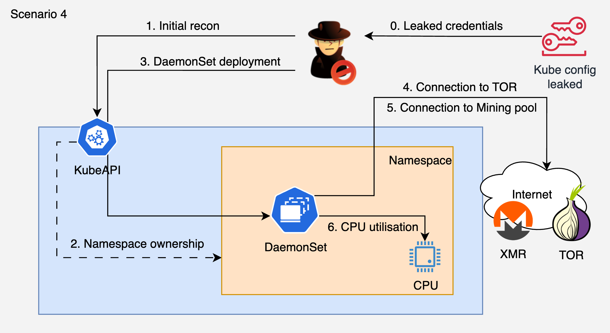

# 4. Leaked Kubeconfig to Cryptominer DaemonSet to Persistence

## 🗺️ Overview
This scenario demonstrates a cryptojacking attack starting from leaked Kubernetes credentials found in a CI/CD pipeline. The attacker authenticates to the cluster, maps node capacity, creates a namespace disguised as a monitoring component, deploys a cryptominer as a DaemonSet (running on every node), establishes self-healing persistence via CronJob, modifies NetworkPolicies to allow Tor egress and block security monitoring, and attempts to delete security agent pods.

This exercise highlights how leaked CI/CD credentials with workload deployment permissions can lead to resource abuse at scale and how attackers combine multiple persistence and evasion techniques.

**Entry point:** Kubeconfig with deployment permissions leaked from CI/CD pipeline

&nbsp;

## 🧩 Required Resources

**Kubernetes**
- Cluster with 1+ worker nodes
- ServiceAccount with create/delete permissions on namespaces, daemonsets, cronjobs, networkpolicies, pods
- No PodSecurityAdmission or admission controller policies enforced (the misconfiguration)

&nbsp;

## 🎯 Scenario Goals
The attacker's objective is to deploy cryptominers on every node in the cluster for maximum hash rate, establish persistence that survives pod/DaemonSet deletion, and evade detection by modifying network policies and deleting security monitoring pods.

&nbsp;

## 🖼️ Diagram


&nbsp;

## 🗡️ Attack Walkthrough
- **Leaked Credentials** - Authenticate to the cluster using a kubeconfig leaked from CI/CD pipeline logs.
- **Cluster Mapping** - Count nodes and check CPU/memory capacity to estimate mining ROI.
- **Attacker Namespace** - Create a namespace named `monitoring-agent` with legitimate-looking labels to blend in.
- **Miner DaemonSet** - Deploy a DaemonSet that runs a cryptominer on every node. Low resource requests to evade LimitRange.
- **CronJob Persistence** - Deploy a CronJob that checks if the DaemonSet exists every 5 minutes and re-creates it if deleted.
- **Network Policy** - Allow Tor egress (ports 9001, 9030) and mining pool (3333). Block ingress from security namespaces.
- **Defense Evasion** - Attempt to delete pods in security tool namespaces (falco, tetragon, kube-system). Even failed attempts generate detection signals.
- **Verify Mining** - Confirm miner pods are running on all nodes and pool handshake succeeded.

&nbsp;

## 📈 Expected Results
**Successful Completion** - Cryptominer running on all nodes, self-healing CronJob active, NetworkPolicies deployed, security pod deletion attempted.

&nbsp;

## 🚀 Getting Started

#### Install Dependencies
The attack machine needs `kubectl` and `jq`.

MacOS
```bash
brew install kubectl jq
```
Linux
```bash
sudo apt update && sudo apt install -y kubectl jq
```

#### Deploy

```bash
# Set your cluster name and AWS profile
export CLUSTER_NAME="your-cluster-name"
export AWS_PROFILE="your-aws-profile"

# Deploy K8s resources (SA + ClusterRole)
kubectl apply -f deploy.yaml

# Generate the "leaked" kubeconfig
chmod +x generate-kubeconfig.sh
./generate-kubeconfig.sh
```

#### Attack Execution
Copy `leaked-kubeconfig.yaml` and `attack.sh` to the attack machine, then:

```bash
export KUBECONFIG=$(pwd)/leaked-kubeconfig.yaml
chmod +x attack.sh
./attack.sh
```

#### 🧹 Clean Up

```bash
# Delete scenario resources (removes all attacker workloads too)
kubectl delete -f deploy.yaml
```
