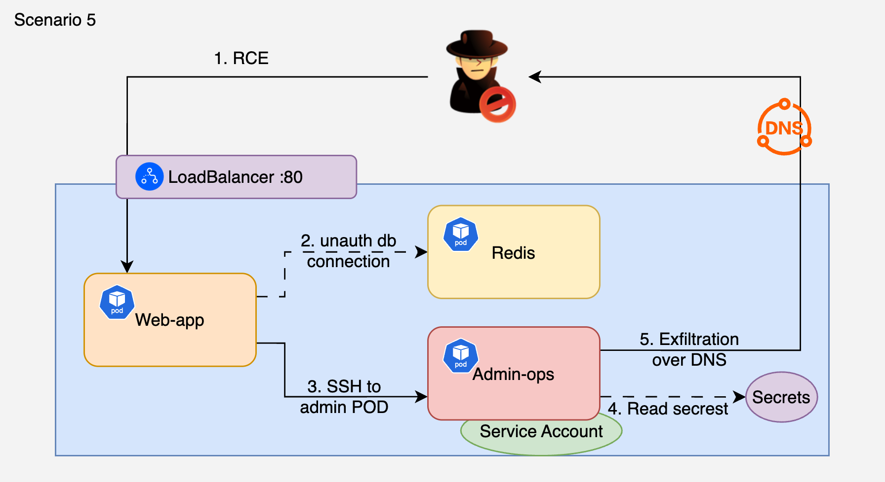

# 5. RCE to Unauthenticated Redis to SSH Lateral Movement to DNS Exfil

## 🗺️ Overview
This scenario demonstrates multi-hop lateral movement through a microservice architecture using three genuinely different exploit techniques. The attacker starts with command injection on a public-facing frontend, discovers and connects to an unauthenticated Redis cache (a real-world misconfiguration), dumps stored credentials including SSH config for an admin pod, pivots via SSH cross-namespace, steals K8s secrets using the admin pod's privileged SA, and exfiltrates everything via DNS tunneling.

The core misconfiguration: no NetworkPolicies between services, unauthenticated Redis, and SSH credentials stored in a cache. Each hop generates abnormal east-west traffic that never existed before.

**Entry point:** Frontend app with command injection (`/run?cmd=`) exposed via LoadBalancer

&nbsp;

## 🧩 Required Resources

**Kubernetes**
- 2 Namespaces: `cdrgoat-sc05-app` (frontend, redis, worker) and `cdrgoat-sc05-infra` (admin)
- 4 Pods:
  - `frontend` - public-facing app with command injection (`/run`), exposed via LoadBalancer
  - `redis-cache` - Redis 7 with no authentication (protected-mode off), seeded with credentials
  - `worker-svc` - background worker connected to Redis (demonstrates legitimate Redis client)
  - `admin-ops` - admin pod with SSH server on port 2022, privileged SA with cross-namespace secret read
- 4 Services (LoadBalancer for frontend, ClusterIP for internal pods)
- No NetworkPolicies between internal services (the core misconfiguration)

&nbsp;

## 🎯 Scenario Goals
The attacker's objective is to chain 2 lateral movement hops using different techniques (Redis exploitation + SSH), steal database credentials and K8s secrets, and exfiltrate data via DNS tunneling. The detection value is in the east-west anomalies and the Redis access pattern.

&nbsp;

## 🖼️ Diagram


&nbsp;

## 🗡️ Attack Walkthrough
- **RCE on Frontend** - Exploit command injection on the `/run` endpoint. Only externally-accessible pod.
- **Service Discovery** - Discover internal services via environment variables and port probing.
- **East-west #1: frontend -> Redis:6379** - Connect to unauthenticated Redis. No credentials needed.
- **Redis Data Dump** - Enumerate all keys, dump sessions, DB credentials, SSH config, API keys, JWT secrets.
- **East-west #2: frontend -> admin-svc:2022** - SSH into admin pod using credentials found in Redis. Cross-namespace hop.
- **Secret Enumeration** - Use admin pod's privileged SA to read K8s secrets cluster-wide.
- **DNS Exfiltration** - Encode stolen data as DNS subdomain labels and exfiltrate via DNS queries.

&nbsp;

## 📈 Expected Results
**Successful Completion** - 2 east-west anomalies generated, Redis fully dumped, SSH cross-namespace pivot, K8s secrets stolen, data exfiltrated via DNS.

&nbsp;

## 🚀 Getting Started

#### Install Dependencies
The attack machine needs `curl` and `jq`.

MacOS
```bash
brew install curl jq
```
Linux
```bash
sudo apt update && sudo apt install -y curl jq
```

#### Deploy

```bash
# Deploy all resources
kubectl apply -f deploy.yaml

# Wait for all pods to be ready (~90s for package installs)
kubectl get pods -n cdrgoat-sc05-app -w
kubectl get pods -n cdrgoat-sc05-infra -w

# Get the LoadBalancer IP/hostname
kubectl get svc frontend-svc -n cdrgoat-sc05-app
```

#### Attack Execution

```bash
chmod +x attack.sh
./attack.sh
```

#### 🧹 Clean Up

```bash
kubectl delete -f deploy.yaml
```
