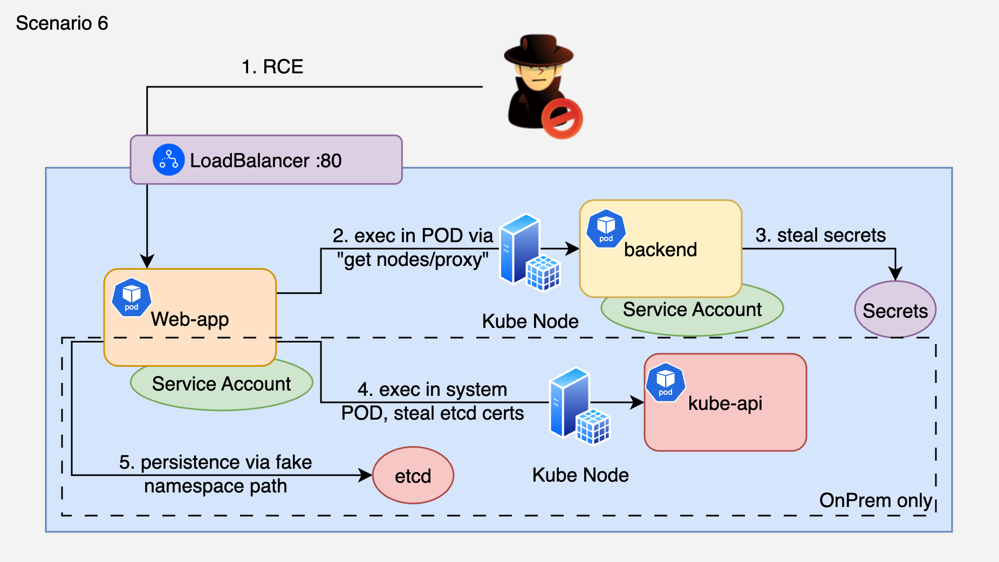

# 6. RCE to nodes/proxy Audit Bypass to etcd Direct Injection

## 🗺️ Overview
This scenario demonstrates two advanced audit evasion techniques. First, the attacker exploits a command injection vulnerability to gain RCE and steal a ServiceAccount token. Using RCE, they install `websocat` inside the compromised pod and exploit the `nodes/proxy` WebSocket bypass to execute commands in a target pod in a different namespace - without generating any `pods/exec` audit events. This is a known Kubernetes design decision (not a bug, upstream marked "Won't Fix") that affects 69+ Helm charts granting `get nodes/proxy` by default.

The attacker steals the target pod's SA token and env vars (including DB credentials and API secrets), then uses the stolen SA token to read K8s Secrets from the target namespace.

On on-prem clusters, the attacker escalates further: using stolen etcd certificates, they inject a persistent privileged pod directly into etcd using the `kubetcd` tool, completely bypassing the Kubernetes API server.

**Entry point:** Flask app with command injection (`/cmd`) exposed via LoadBalancer

&nbsp;

## 🧩 Required Resources

**Kubernetes**
- 2 Namespaces: `cdrgoat-sc06` (attacker's web-app) and `cdrgoat-sc06-target` (target pod with secrets)
- Web-app SA with `list pods/services/namespaces/nodes` + `get nodes/proxy` permissions
- Target SA with `list/get secrets` in its namespace
- 2 Pods:
  - `web-app` - Flask app with RCE vulnerability (`/cmd`) in `cdrgoat-sc06`
  - `backend-api` - Target pod with DB credentials in env + payment secrets in K8s Secret, in `cdrgoat-sc06-target`
- Service (LoadBalancer) exposing web-app on port 80

**For etcd injection (on-prem only)**
- Control plane node access with etcd client certificates
- `kubetcd` tool (Go binary from NCC Group): https://github.com/nccgroup/kubetcd
- `etcdctl` installed on the attack machine or control plane node

&nbsp;

## 🎯 Scenario Goals
The attacker's objective is to execute commands in a cross-namespace pod via the nodes/proxy WebSocket bypass (audit log shows GET, not exec), steal credentials from that pod's environment and K8s Secrets, and on on-prem clusters inject a persistent pod via direct etcd write. Both techniques bypass standard SIEM detection rules.

&nbsp;

## 🖼️ Diagram


&nbsp;

## 🗡️ Attack Walkthrough
- **RCE Exploitation** - Exploit command injection on `/cmd` to steal SA token and install websocat in the pod.
- **Permission Discovery** - Check key permissions: `get nodes/proxy` (YES), `create pods/exec` (NO). The SA can bypass the exec RBAC via the proxy path.
- **Audit-Invisible Exec** - Locate the target pod on its node, connect via WebSocket to Kubelet:10250. Execute `whoami`, `hostname`, `env`, `cat SA token` in the target pod. All without pods/exec audit events.
- **Stolen Token Pivot** - Decode the stolen SA token, use it to list and read K8s Secrets in the target namespace (payment gateway credentials).
- **(On-prem) etcd Cert Theft + Injection** - Find the control plane node, exec into the kube-apiserver pod via the same Kubelet WebSocket technique, steal etcd certificates from `/etc/kubernetes/pki/etcd/`. Then use kubetcd to inject a privileged pod directly into etcd. Pod appears in `kubectl get pods` but has no creation audit event and cannot be deleted via kubectl.
- **Verify Results** - Confirm audit gaps and summarize stolen credentials.

&nbsp;

## 📈 Expected Results
**Successful Completion** - Cross-namespace command execution via nodes/proxy with zero pods/exec audit events. DB credentials and payment secrets stolen. On on-prem: persistent pod injected via etcd with zero audit trail.

&nbsp;

## 🚀 Getting Started

#### Install Dependencies
The attack machine needs `curl`, `jq`, and `kubectl`. Run from a **dedicated attack VM**, not your personal laptop. `websocat` is installed inside the compromised pod during the attack.

MacOS
```bash
brew install curl jq kubectl
```
Linux
```bash
sudo apt update && sudo apt install -y curl jq kubectl
```

#### Deploy

```bash
# Deploy K8s resources
kubectl apply -f deploy.yaml

# Wait for all pods to be ready (~60s)
kubectl get pods -n cdrgoat-sc06 -w
kubectl get pods -n cdrgoat-sc06-target -w

# Get the LoadBalancer IP/hostname
kubectl get svc web-app-svc -n cdrgoat-sc06
```

#### Attack Execution
The script will ask whether to download `kubetcd` from GitHub or use a local binary. For managed K8s (EKS/GKE/AKS), the etcd step is automatically skipped.

```bash
chmod +x attack.sh
./attack.sh
```

#### 🧹 Clean Up

```bash
# Delete scenario resources
kubectl delete -f deploy.yaml

# If etcd injection was performed (on-prem only):
# The injected pod cannot be deleted via kubectl (fake namespace path).
# Use etcdctl directly to remove it:
# etcdctl del /registry/pods/kube-system/cdrgoat-sys-monitor \
#   --cacert /etc/kubernetes/pki/etcd/ca.crt \
#   --cert /etc/kubernetes/pki/etcd/server.crt \
#   --key /etc/kubernetes/pki/etcd/server.key
```
